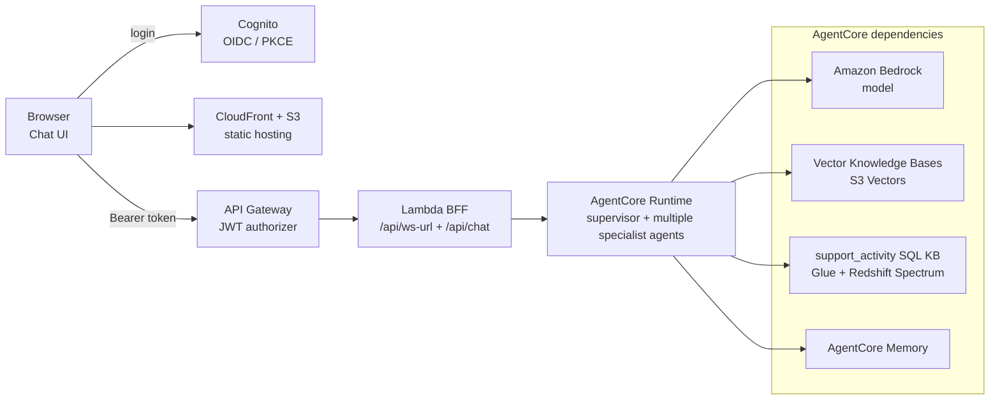

# wel-agents-poc

WEL-MOTHER に Agent 機能を追加するための PoC。AI Agent の構築は [Strands Agents TypeScript SDK](https://strandsagents.com/) を採用しています。

## セットアップ & 実行

```bash
# 初期セットアップ（mise install → bun install → git hook）
mise run bs

# 各 runtime の env テンプレートをコピーして値を埋める（.env は gitignore 済み）
cp packages/agentcore/.env.example packages/agentcore/.env
cp packages/bff/.env.example       packages/bff/.env
cp packages/chat-ui/.env.example   packages/chat-ui/.env

# local AgentCore を開発実行（packages/agentcore/.env を読み込む）
mise run dev:agentcore

# 別 terminal で local BFF を開発実行（packages/bff/.env を読み込む）
mise run dev:bff

# 別 terminal で静的 Chat UI を起動（packages/chat-ui/.env を読み込む）
mise run dev:ui

# テスト実行（bun test でも可）
bun run test
```

## デプロイ

デプロイ手順は [`terraform/aws/`](./terraform/aws/README.md)を参照してください。標準順は`agentcore` → `auth` → `bff` → `chat-ui` です。

設定済み環境（各 stack の `terraform.tfvars`・AWS 認証・container engine が揃った状態）では、全 stack を一括で適用 / 破棄できます（完全非対話・`-auto-approve`、開始時に AWS account / region を表示）。

```bash
# 全 stack を依存順に適用（build・image push・stack 間 output 注入・2パス循環解消まで一括）
mise run aws:apply

# 全 stack を逆順に破棄
mise run aws:destroy

# 単体（失敗した stack だけ再実行可）
mise run aws:apply:bff
mise run aws:destroy:chat-ui
```

KB ingestion は `aws:apply` 内で起動のみ（完了は待たない）。詳細と前提は [`terraform/aws/`](./terraform/aws/README.md#一括-apply--destroy) を参照してください。

## 構成



| リソース | 説明 |
| --- | --- |
| [`AgentCore Runtime`](./packages/agentcore/README.md) | supervisor + 複数の専門 RAG agent、vector Knowledge Base retrieval、support_activity structured-data provider、Memory 連携を扱います。 |
| [`Auth`](./terraform/aws/auth/README.md) | Cognito User Pool + public App Client + Hosted UI で OIDC provider を作り、Chat UI の PKCE login と BFF の JWT authorizer 設定を提供します。 |
| [`BFF`](./packages/bff/README.md) | Chat UI / API Gateway と AgentCore Runtime の間で、`/api/ws-url` の presigned URL 発行、既存 `/api/chat` fallback、payload 変換を扱います。 |
| [`Chat UI`](./packages/chat-ui/README.md) | React browser UI、WebSocket streaming chat、conversation ID、OIDC PKCE auth state、Vite dev / preview / build 設定を扱います。 |

## ディレクトリ構成

```text
wel-agents-poc/
├── package.json          # Bun workspaces ルート（横断ツール + build:* 委譲 + 単一 bun.lock）
├── packages/                  # 各サブディレクトリは workspace（自分の package.json で依存と build を所有）
│   ├── agentcore/        # AgentCore Runtime（@wel-agents-poc/agentcore。entrypoint + contracts/domain/application/adapters/infra）
│   ├── bff/              # BFF（@wel-agents-poc/bff。root wrappers + contracts/domain/application/adapters/infra）
│   └── chat-ui/          # React Chat UI（@wel-agents-poc/chat-ui。Vite dev/build、/api/ws-url + /api/chat proxy）
├── Dockerfile.agentcore  # AgentCore Runtime 用 Bun コンテナ
├── terraform/            # IaC
│   ├── aws/
│   │   ├── agentcore/    # AgentCore Runtime・vector KB・support_activity SQL KB・Memory・ECR・IAM
│   │   ├── auth/         # Cognito User Pool + App Client + Hosted UI（OIDC IdP）
│   │   ├── bff/          # API Gateway + Lambda BFF
│   │   └── chat-ui/      # S3 + CloudFront Chat UI hosting
│   └── gc/               # Google Cloud（WIP）
├── tools/                # セットアップ・クリーンアップスクリプト・structured-data generator
├── .agents/              # Codex 用スキル（Strands 公式ドキュメント参照）
└── .claude/              # Claude Code 用ルール・スキル
```
