# 専門職コメント・演習・教材管理（issue #8/#9/#10）DB スキーマと AWS インフラ検討

確認日: 2026-07-30

## Summary

issue #8（専門職コメントからのノウハウ・教材候補蓄積）、issue #9（新人保健師向け演習）、issue #10（教材・評価ルーブリック・参照知識・マスタ対応の管理）は、いずれも SOAP Studio（issue #5/#6）と Voice Capture（issue #7）が作った「下書き」を、レビュー・教材化・演習・管理という後工程に繋げるための永続化機能である。
現行の `wel-agents-poc` には Bedrock Knowledge Base（vector / SQL）と S3 オブジェクト以外に**永続的な OLTP データストアが存在しない**ため、この3 issue に着手する前提として、コメント・教材候補・演習・ルーブリックを保存できるリレーショナル DB を新設する必要がある。
本メモは、この3 issue に共通するデータモデル（テーブル設計）と、それを載せる AWS インフラ（Aurora Serverless v2 PostgreSQL + RDS Data API を推奨）を検討する。

## 実装状況（追記、2026-07-30）

以下は本メモの提案どおりに実装済み。

- **Aurora Serverless v2 (PostgreSQL) + RDS Data API**: `terraform/aws/bff/training-data.tf` として `terraform/aws/bff` に追加済み（提案どおりの配置）。`min_capacity = 0` の scale-to-zero 構成で稼働中。
- **マイグレーション**: `terraform/aws/bff/migrations/0001_init.sql`（全テーブル・enum 型）+ `0002_seed_masters.sql`（specialties/learning_themes/difficulty_levels/rejection_reason_codes/quality_metrics_definitions の初期値）。ORM は導入せず、提案どおり repo 既存流儀（SQL を直接組み立てる）で `tools/db-migrate/run-migrations.ts` から Data API 経由で適用する軽量ランナーを実装。
- **前提（SOAP 正式記録・編集履歴）**: 実装済み。`POST /api/soap-records` / `GET /api/soap-records` / `GET /api/soap-records/{recordId}/versions`（`packages/bff/infra/soap-record-store.ts`）。SOAP Studio の「正式記録として保存」ボタンから呼ばれる。
- **issue #8（専門職コメント・教材候補）**: 実装済み。`POST /api/professional-comments` + `GET /api/professional-comments`、`GET/POST /api/material-candidates` + `PATCH /api/material-candidates/{id}/status`。加えて、本メモの提案時点では未設計だった **`POST /api/material-candidates/{id}/promote-to-material`** を追加した — 承認済み (`status: approved`) の教材候補を issue #10 の `materials` 行（`material_type: comment_derived_note`、`publication_status: draft`）に変換し、当初から schema にあった `material_candidates.material_id` 列（提案時点では「承認 gate を通過したらリンクする想定」とコメントしていた列）を実際に書き込む。自動連携ではなく Knowledge Review 画面から手動でトリガーする設計。
- **issue #10（教材・ルーブリック・SOAP マッピング・必須推奨項目・品質指標）**: 実装済み。`GET/POST /api/materials` + `PATCH /api/materials/{id}/status`、`GET/POST /api/rubrics` + `PATCH /api/rubrics/{id}/review-status`、`GET /api/soap-mapping-versions` + `POST /api/soap-mapping-versions`、`GET/POST /api/required-items`、`GET /api/quality-metrics`。`GET /api/reference-knowledge` も実装したが read-only のまま（`reference_knowledge` テーブルへの作成 UI・シードデータは無く、実データは空）。
- **issue #9（新人保健師向け演習）**: **未着手**。Workbench の Training 画面（`packages/workbench/src/features/training/`）は dummy データのままで、本メモの `exercise_*` テーブル群は未実装。

以下は提案から変わった/未実装のままの点。

- **ロールモデル（Cognito Group + `app_users.roles` ミラー）は未実装**。実際は Workbench 側の demo 用ロール切り替え（`model/roles.ts`。クライアント表示の出し分けのみで DB アクセス制御ではない）と、`professional_comments.author_role_at_post` / `material_candidate_status_events.changed_by_role`（自由記述の text 列、クライアントが送った値をそのまま記録するだけ）に留まる。issue #8 の Open Question「教材候補の承認者ロール」は本メモの想定どおり未決着のままで、実サーバー側の RBAC は今後の課題。
- **スキーマの細部**が実装時に変わっている: enum 相当の列は提案時の `text + check` ではなく Postgres の native `enum` 型（`material_type` / `publication_status` 等）で実装、`materials.material_type` の値は `exercise_case` ではなく `teaching_case` / `comment_derived_note` / `reference_summary`、`specialty_id` / `learning_theme_id` / `difficulty_id` / `record_type` は `uuid` FK ではなくブラウザ表示用固定文字列を id にした `text` FK（`specialties.id` 等）、`required_recommended_items` に `created_by` 列は無い。正確な列定義は `terraform/aws/bff/migrations/0001_init.sql` を正とする。

## Context

### 現状のアーキテクチャ制約

- SOAP Studio（`packages/workbench` の SOAP 下書き生成 / 不足確認）は完全に **session-local** で、下書き候補・不足確認の回答はブラウザ状態にしかなく、正式記録への保存経路が存在しない。
- Voice Capture（issue #7）は音声原本と transcript を S3 に保存するが、`packages/bff/infra/voice-capture-store.ts` が示す通り「recordingId をキーにした S3 オブジェクトの KVS」であり、リレーショナルな検索・結合・状態遷移には向かない。
- `support_activity` の Redshift Serverless / Glue / Lake Formation 構成（`terraform/aws/agentcore/structured-data.tf` 他）は、Bedrock SQL Knowledge Base が自然言語から SQL を生成して**読み取り専用で検索**するための構成であり、committed synthetic Parquet を想定した RAG 用ストアである。コメントの追記・教材候補の状態遷移・演習回答の逐次書き込みのような **OLTP（頻繁な単票 INSERT/UPDATE、外部キー整合性、行レベル権限）** には不向きで、この用途に転用すべきではない。
- 認可は Cognito の JWT `sub` / `email` から `actorId` / `userId` / `displayName` を導出するだけで（`packages/bff/domain/auth.ts`）、ロール（専門職・レビュー承認者・新人保健師・指導者・管理者）の概念がまだ存在しない。issue #8 の「権限のない利用者はアクセス不可」、issue #9 の受講者/指導者ロール、issue #10 の管理者ロールはいずれもロールモデルの追加を前提にしている。
- `packages/workbench` の Workspace Nav には「Knowledge Review」「Training」が準備中表示として既に用意されている。issue #8 は Knowledge Review、issue #9 は Training に対応する画面と見てよい。issue #10 は既存 nav にない管理用画面（Admin 相当）が別途必要になる。

### 3 issue の依存関係

issue #9（演習）は issue #8（教材候補）と issue #10（教材・ルビリック・参照知識の管理）の両方に依存する。演習ケースは「教材」の一種として issue #10 の公開状態管理に乗るべきで、模範回答の評価観点は issue #10 のルーブリックと同じ概念であるべきである。issue #8 は SOAP Studio の下書き・正式記録・編集履歴を参照するため、**正式記録と編集履歴そのものの永続化**（現状は session-local）が issue #8 未満の前提作業として必要になる。

## 全体方針

### データストア: Aurora Serverless v2 (PostgreSQL) + RDS Data API

| 選択肢 | 評価 |
| --- | --- |
| **Aurora Serverless v2 PostgreSQL + Data API（推奨）** | 外部キー・トランザクション・多条件検索（分野×記録種別×学習テーマ×難易度）・集計（issue #10 の品質指標）に強い。Data API は HTTPS 経由で呼べるため BFF Lambda を VPC に入れずに済み、`support_activity` が既に使っている Redshift Data API（`aws_redshiftdata_statement`）と同じ「Lambda から Data API 越しに SQL を打つ」パターンを踏襲できる。 |
| DynamoDB | Lambda との親和性は高いが、多条件のアドホック検索や issue #10 の集計指標（分類精度・不足検出率・採用率など）を素直に書けず、GSI 設計が煩雑になる。教材候補・演習の検索要件（issue #8/#9 の Acceptance Criteria が明示する複合条件検索）とは相性が悪い。 |
| 既存 Redshift Serverless の拡張利用 | OLAP 用でロック粒度・小規模頻繁書き込みに弱く、Bedrock SQL KB の retrieval 専用ストアという役割と混同すると設計が汚れる。不採用。 |
| RDS（非 Aurora）PostgreSQL | 常時起動でしか使えず（auto-pause 機能がない）、PoC のような断続的利用ではコスト効率が悪い。不採用。 |

Aurora Serverless v2 は ACU が 0 まで落ちない構成もあるため（エンジンバージョン・リージョンにより挙動が異なる）、`law_hierarchical` の OpenSearch Serverless と同様に **継続課金の可能性を明示して運用者に伝える**（後述「AWS インフラ」節）。

### アクセス経路: DB を触るのは BFF だけにする

AgentCore は現在も無状態（KB retrieval と Memory 以外の永続化を持たない）ため、この方針を崩さない。演習フィードバック生成のような AI 処理が必要な場合も、`soap_draft` / `soap_gaps` と同じパターン（BFF が DB から必要なコンテキストを読み、payload に埋め込んで AgentCore の単発 agent を呼び、応答を BFF が DB に書き戻す）を踏襲する。これにより DB への IAM 権限は BFF 実行ロールだけに閉じられる。

### ロールモデル: Cognito Group + `app_users` へのミラー

Cognito User Pool に Group（例: `nurse` 専門職, `reviewer` レビュー承認者, `trainee` 新人保健師, `instructor` 指導者, `admin` 管理者）を追加し、JWT の `cognito:groups` claim を `packages/bff/domain/auth.ts` の `authContextFromJwtClaims` と同様の方法で `roles: string[]` として取り出す。DB 側には `app_users`（`id` = Cognito `sub`、`display_name`、`roles` を同期時点でミラー）を持ち、コメント投稿・承認・提出などの行には **実行時点のロールをスナップショット**として保存する（後からロールが変わっても過去の承認記録の意味が変わらないようにするため）。行レベルのアクセス制御は、既存アーキテクチャに合わせて最初は BFF アプリケーション層での認可チェックとし、Postgres の Row Level Security は将来の強化オプションとして残す（issue #8 の Open Question「承認者ロール」が確定していないため、DB 側は `roles` を汎用文字列配列にして先取りで決め切らない）。

### タグ体系: 3 issue 共通のマスタ

分野（specialty）・記録種別（record_type）・学習テーマ（learning_theme）・難易度（difficulty）は issue #8/#9 の両方が検索軸として使う。記録種別は既存の `SOAP_RECORD_TYPES`（`support_activity` / `general_record` / `meeting` / `summary`、`packages/agentcore/contracts/soap-draft.ts`）をそのまま再利用する。specialty / learning_theme / difficulty はコード値の自由文字列ではなくマスタテーブル化し、issue #10 の「マスタ対応管理」からこの3マスタと必須・推奨項目マスタを一括管理できるようにする。

### バージョニング戦略

issue #10 は「SOAP マッピングの変更を既存記録へ即時反映せず、新規解析からのみ適用する」ことを明示している。これは **設定を上書きせず、バージョン行を追加し、記録側は生成時点のバージョン ID を外部キーで固定する** という設計でしか安全に実現できない。同じパターンを教材・ルーブリックにも適用し、「現在の設定」ではなく「その記録/演習/教材候補が生成・評価された時点の設定」を常に遡って再現できるようにする。

## 前提: SOAP 正式記録・編集履歴の永続化（新規）

issue #8 のコメントは「対象記録・記録版」に紐づく必要があるが、正式記録も編集履歴も現状は存在しない。issue #8 着手前に以下を追加する。

```sql
create table soap_records (
  id uuid primary key default gen_random_uuid(),
  record_type text not null check (record_type in ('support_activity','general_record','meeting','summary')),
  status text not null default 'draft' check (status in ('draft','finalized')),
  created_by uuid not null references app_users(id),
  created_at timestamptz not null default now()
);

create table soap_record_versions (
  id uuid primary key default gen_random_uuid(),
  record_id uuid not null references soap_records(id),
  version_no integer not null,
  content jsonb not null, -- S/O/A/P ごとの確定候補（soapDraftCandidate 形状に準拠）
  source text not null check (source in ('soap_draft_ai','voice_capture','manual')),
  soap_mapping_version_id uuid references soap_mapping_versions(id), -- issue #10。生成時点のマッピングを固定
  recording_id text, -- Voice Capture の recordingId（由来 tag。issue #7 の引き継ぎと同じ扱い）
  created_by uuid not null references app_users(id),
  created_at timestamptz not null default now(),
  unique (record_id, version_no)
);
```

`soap_record_versions` は追記専用（UPDATE しない）にすることで、そのまま issue #8 が言う「編集履歴」になる。

## issue #8: 専門職コメント・教材候補

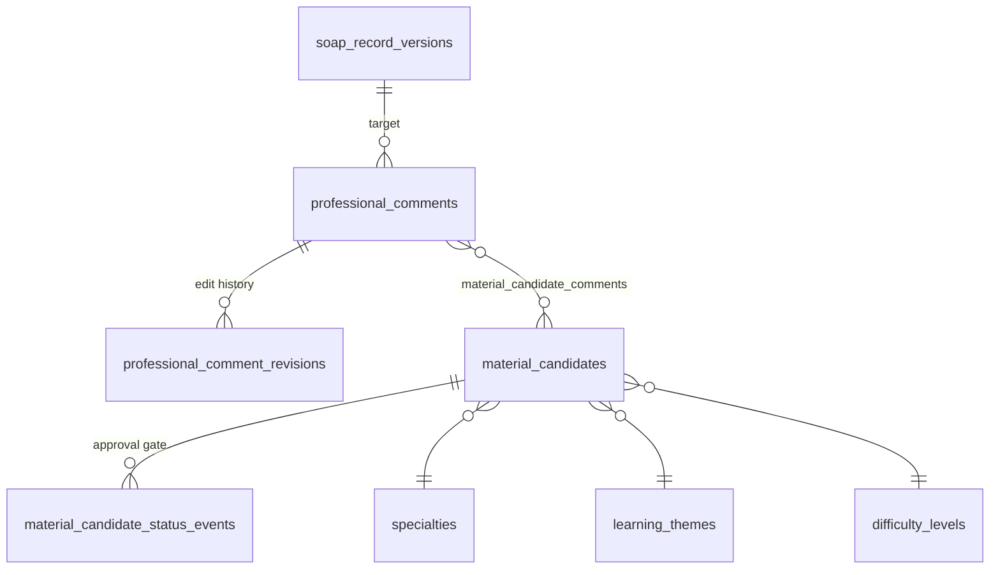

```sql
create table professional_comments (
  id uuid primary key default gen_random_uuid(),
  target_record_id uuid not null references soap_records(id),
  target_record_version_id uuid not null references soap_record_versions(id),
  soap_category text check (soap_category in ('S','O','A','P','UNCLASSIFIED')), -- 対象が候補単位の場合
  comment_type text not null check (comment_type in ('review','correction_rationale','instruction_note','case_study')),
  body text not null, -- 思考経路を含む自由記述
  author_id uuid not null references app_users(id),
  author_role_at_post text not null,
  created_at timestamptz not null default now()
);

-- 編集履歴の保持範囲は issue #8 の Open Question。編集時だけ行を追加する設計にして、
-- 「編集不可にする」「全履歴を残す」のどちらの結論でもスキーマ変更なしに対応できるようにする。
create table professional_comment_revisions (
  id uuid primary key default gen_random_uuid(),
  comment_id uuid not null references professional_comments(id),
  previous_body text not null,
  edited_by uuid not null references app_users(id),
  edited_at timestamptz not null default now()
);

create table material_candidates (
  id uuid primary key default gen_random_uuid(),
  title text not null,
  summary text not null,
  status text not null default 'candidate' check (status in ('candidate','approved','rejected','needs_revision')),
  specialty_id uuid references specialties(id),
  record_type text check (record_type in ('support_activity','general_record','meeting','summary')),
  learning_theme_id uuid references learning_themes(id),
  difficulty_id uuid references difficulty_levels(id),
  rejection_reason_code text references rejection_reason_codes(code), -- issue #10 のマスタで分類（Open Question）
  approver_id uuid references app_users(id),
  material_id uuid references materials(id), -- 承認 gate を通過したら issue #10 の materials へリンク
  created_by uuid not null references app_users(id),
  created_at timestamptz not null default now(),
  updated_at timestamptz not null default now()
);

create table material_candidate_comments (
  material_candidate_id uuid not null references material_candidates(id),
  comment_id uuid not null references professional_comments(id),
  primary key (material_candidate_id, comment_id)
);

create table material_candidate_status_events (
  id uuid primary key default gen_random_uuid(),
  material_candidate_id uuid not null references material_candidates(id),
  from_status text,
  to_status text not null,
  changed_by uuid not null references app_users(id),
  changed_by_role text not null,
  reason_text text,
  changed_at timestamptz not null default now()
);
```

`professional_comments` → `material_candidates` を多対多にしているのは、1件のコメントが複数の教材候補に転用されたり、複数コメント（レビュー・訂正理由・指導メモ）を束ねて1つの教材候補にする、という Technical Approach の「ケース学習」的な使い方を想定しているため。アクセス制御（「権限のない利用者はコメント・教材候補を開けない」）は BFF の認可チェックで `roles` に `nurse`/`reviewer`/`admin` が含まれるかを見て弾く。

## issue #9: 新人保健師向け演習

演習ケースは issue #10 の `materials`（教材、公開状態を持つ）の**拡張テーブル**として設計する。これにより演習の公開/レビュー状態を issue #10 の管理画面から一元管理できる。

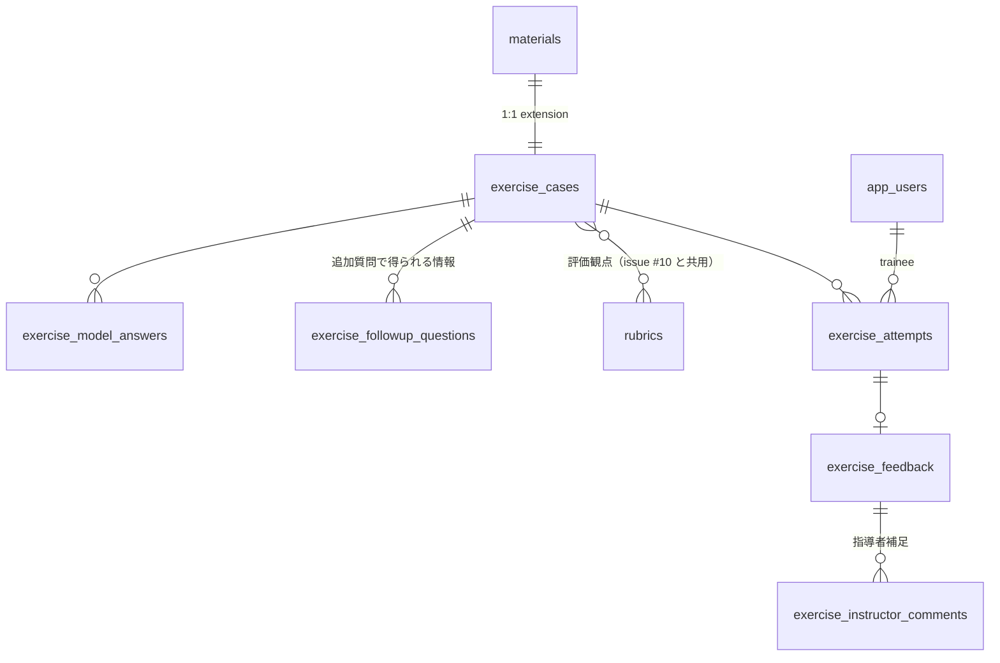

```sql
create table exercise_cases (
  material_id uuid primary key references materials(id),
  initial_presentation jsonb not null, -- 初期提示情報
  constraints_text text,
  expected_work_scene text, -- 想定業務場面
  required_institutional_knowledge text, -- 必要な制度知識（自由記述 or reference_knowledge 参照）
  related_master_refs jsonb -- 関連マスタ（required_recommended_items 等への参照）
);

create table exercise_followup_questions (
  id uuid primary key default gen_random_uuid(),
  exercise_case_material_id uuid not null references exercise_cases(material_id),
  question_text text not null, -- 追加確認事項の設問
  revealed_info_text text not null, -- 質問すると得られる追加情報
  order_no integer not null
);

create table exercise_model_answers (
  id uuid primary key default gen_random_uuid(),
  exercise_case_material_id uuid not null references exercise_cases(material_id),
  answer_type text not null check (answer_type in ('soap','assessment','support_plan')),
  content jsonb not null,
  acceptable_note text -- 複数の妥当な判断パターンのうち、この解答が許容される理由
);

create table exercise_case_rubrics (
  exercise_case_material_id uuid not null references exercise_cases(material_id),
  rubric_id uuid not null references rubrics(id),
  primary key (exercise_case_material_id, rubric_id)
);

create table exercise_attempts (
  id uuid primary key default gen_random_uuid(),
  exercise_case_material_id uuid not null references exercise_cases(material_id),
  trainee_id uuid not null references app_users(id),
  status text not null default 'in_progress' check (status in ('in_progress','submitted','feedback_ready')),
  answer_followups jsonb, -- 選んだ追加確認事項とその回答
  answer_soap jsonb,
  answer_assessment text,
  answer_support_plan text,
  started_at timestamptz not null default now(),
  submitted_at timestamptz
);

create table exercise_feedback (
  id uuid primary key default gen_random_uuid(),
  attempt_id uuid not null references exercise_attempts(id),
  generated_by text not null check (generated_by in ('ai','instructor')),
  data_collection_note text, -- 情報収集の改善点
  rationale_note text,       -- 根拠
  assessment_note text,      -- アセスメント
  support_plan_note text,    -- 支援方針
  documentation_note text,   -- 記録表現
  created_at timestamptz not null default now()
);

create table exercise_instructor_comments (
  id uuid primary key default gen_random_uuid(),
  feedback_id uuid not null references exercise_feedback(id),
  instructor_id uuid not null references app_users(id),
  body text not null,
  created_at timestamptz not null default now()
);
```

「回答履歴と弱点傾向」は書き込みが発生しない導出データなので、専用テーブルではなく `exercise_attempts` / `exercise_feedback` を `specialty_id` / `learning_theme_id`（`exercise_cases` 経由）で集計する **view** として提供する（issue #10 の「初期は設定/seed から始め、必要なものだけ UI 化する」という方針と一致させ、書き込み経路を増やさない）。集計粒度（分野別か学習テーマ別か個人別か）は issue #9 の Open Question のため、view の GROUP BY 軸は結論が出るまで確定しない。

## issue #10: 教材・評価ルーブリック・参照知識・マスタ対応

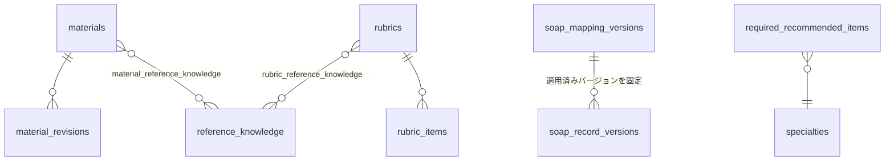

```sql
create table materials (
  id uuid primary key default gen_random_uuid(),
  material_type text not null check (material_type in ('exercise_case','comment_derived_note','reference_summary')),
  title text not null,
  publication_status text not null default 'draft' check (publication_status in ('draft','reviewing','published','archived')),
  specialty_id uuid references specialties(id),
  learning_theme_id uuid references learning_themes(id),
  difficulty_id uuid references difficulty_levels(id),
  created_by uuid not null references app_users(id),
  created_at timestamptz not null default now(),
  updated_at timestamptz not null default now()
);

create table material_revisions (
  id uuid primary key default gen_random_uuid(),
  material_id uuid not null references materials(id),
  from_status text,
  to_status text not null,
  changed_by uuid not null references app_users(id),
  changed_at timestamptz not null default now()
);

create table rubrics (
  id uuid primary key default gen_random_uuid(),
  name text not null,
  target_type text not null check (target_type in ('exercise_feedback','material_review')),
  review_status text not null default 'expert_review_required'
    check (review_status in ('expert_review_required','confirmed')),
  version_no integer not null default 1,
  created_by uuid not null references app_users(id),
  created_at timestamptz not null default now()
);

create table rubric_items (
  id uuid primary key default gen_random_uuid(),
  rubric_id uuid not null references rubrics(id),
  criterion_name text not null,
  description text,
  order_no integer not null
);

create table reference_knowledge (
  id uuid primary key default gen_random_uuid(),
  title text not null,
  summary text not null,
  source_type text not null check (source_type in ('law','medical_care_law','internal_note')),
  external_kb_ref text, -- 既存 vector KB のドキュメント参照（内容を複製せず参照するだけ）
  created_at timestamptz not null default now()
);

create table material_reference_knowledge (
  material_id uuid not null references materials(id),
  reference_knowledge_id uuid not null references reference_knowledge(id),
  primary key (material_id, reference_knowledge_id)
);

create table rubric_reference_knowledge (
  rubric_id uuid not null references rubrics(id),
  reference_knowledge_id uuid not null references reference_knowledge(id),
  primary key (rubric_id, reference_knowledge_id)
);

create table soap_mapping_versions (
  id uuid primary key default gen_random_uuid(),
  record_type text not null check (record_type in ('support_activity','general_record','meeting','summary')),
  version_no integer not null,
  mapping_definition jsonb not null,
  is_current boolean not null default false,
  effective_from timestamptz not null default now(),
  created_by uuid not null references app_users(id),
  unique (record_type, version_no)
);

create table required_recommended_items (
  id uuid primary key default gen_random_uuid(),
  record_type text not null check (record_type in ('support_activity','general_record','meeting','summary')),
  specialty_id uuid references specialties(id),
  item_name text not null,
  requirement_level text not null check (requirement_level in ('required','recommended')),
  aggregation_category text,
  effective_from timestamptz not null default now()
);

create table quality_metrics_definitions (
  metric_key text primary key check (metric_key in (
    'classification_accuracy','gap_detection_rate','adoption_rate',
    'correction_rate','bounce_back_rate','learning_effectiveness'
  )),
  display_name text not null,
  calculation_description text not null,
  target_entity text not null
);
```

品質指標（分類精度・不足検出率・採用率・修正率・差し戻し率・学習効果）は issue #10 が「項目が定義されていること」だけを Acceptance Criteria にしているため、`quality_metrics_definitions` は**定義**だけを持つマスタとし、実際の値は `soap_record_versions` / `material_candidate_status_events` / `exercise_attempts` を集計する view / 定期集計ジョブに委ねる（生の指標値テーブルを持つと、issue #10 自身が戒めている「初期から作り込みすぎる」に反する）。

## AWS インフラ提案（提案どおりに実装・deploy 済み）

### 配置場所: `terraform/aws/bff` に追加

Voice Capture の S3 bucket（`terraform/aws/bff/voice-capture.tf`）が「BFF が使うデータストアは bff stack に置く」という前例になっている。DB アクセスを BFF に限定する方針（前述）と合わせ、新しい Aurora cluster も `terraform/aws/bff` 配下に `training-data-store.tf` として追加し、`agentcore` → `auth` → `bff` → `chat-ui` という既存の apply 順を変えない。

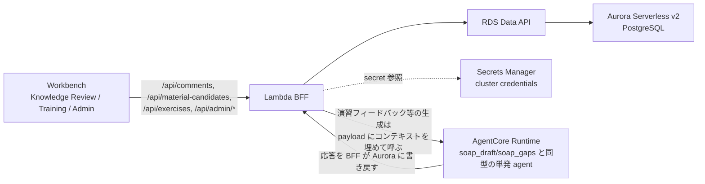

### 追加リソース

- `aws_rds_cluster.training_data`（`engine_mode = "provisioned"`, `engine = "aurora-postgresql"`, `engine_version` は 0 ACU scale-to-zero 対応版（`15.7` 系以降 / `16.3` 系以降）を明示指定、`serverlessv2_scaling_configuration { min_capacity = 0, max_capacity = 1 }`（PoC 期間中の既定値。負荷試験や複数人同時利用を検証する時だけ `max_capacity` を tfvars で上げる）、`enable_http_endpoint = true` で Data API を有効化）
- `aws_rds_cluster_instance.training_data`（Serverless v2 用の writer instance、`instance_class = "db.serverless"`）
- `aws_secretsmanager_secret` + `aws_secretsmanager_secret_version`（Data API 用の DB 認証情報。Aurora の `master_user_secret`（manage_master_user_password）を使えば Terraform 側で平文を持たずに済む）
- `aws_db_subnet_group`（既存の default VPC 前提を Redshift と共有。`terraform/aws/agentcore` が要求している default VPC がそのまま使える）
- `aws_security_group`（Data API は HTTPS 経由のため実は VPC 内 SG ルールは最小でよいが、cluster 自体は VPC 内に存在するため subnet/SG の指定は必要）
- BFF 実行ロールへの IAM policy 追加：`rds-data:ExecuteStatement` / `rds-data:BatchExecuteStatement` / `rds-data:BeginTransaction` / `rds-data:CommitTransaction` / `rds-data:RollbackTransaction`（cluster ARN に限定）、`secretsmanager:GetSecretValue`（cluster secret ARN に限定）

### ローカル開発への影響

Voice Capture と同じ考え方（`mise run dev:bff` は BFF 自身の AWS 認証情報で直接 AWS を呼ぶ）を踏襲し、ローカルの `bun dev-server.ts` も Data API を直接呼ぶ。`terraform/aws/bff/README.md` の「S3 bucket だけを `-target` で先に作る」手順と同様に、Aurora cluster と Secrets Manager secret だけを `-target` で先行 apply できるようにし、`packages/bff/.env` に cluster ARN / secret ARN / database name を転記する運用にする。

### コスト・運用上の注意（PoC 段階向け）

Aurora Serverless v2 は 2024-11 以降、`min_capacity = 0`（scale-to-zero、対応エンジンバージョンは Aurora PostgreSQL `13.15+` / `14.12+` / `15.7+` / `16.3+`）に正式対応している。接続が無い期間は自動で pause し、pause 中は ACU 課金が発生せず storage 分のみ課金される。この PoC のデータ量（コメント・教材候補・演習回答が主で、大量の添付バイナリは持たない設計）なら storage は数GB程度に収まり、pause 中の実費は月数百円〜数ドル程度まで下げられる。

このため tfvars の既定値は次の通りにし、常時起動のコストを持たない構成を明示する。

- `min_capacity = 0` / `max_capacity = 1`（PoC 期間の既定。max を上げるのは複数人同時アクセスや負荷検証の時だけ）
- `engine_version` は scale-to-zero 対応バージョンを固定指定（バージョンを指定し忘れると古いデフォルトバージョンが選ばれ 0 ACU 設定が `InvalidParameterCombination` で apply エラーになるため）

> [WARNING] **確認済みの正式レート（us-east-1）は Aurora Standard で $0.12/ACU-時間・storage $0.10/GB-月・I/O $0.20/百万リクエスト。ap-northeast-1（東京）の正式レートは未確認（AWS 認証情報が無く Pricing API を叩けなかった）ため、apply 前に AWS Pricing Calculator で実レートを確認すること。** `min_capacity = 0` が効かない/未対応リージョンだった場合、`min_capacity = 0.5` の常時起動フロアだけで us-east-1 換算で概算 $43/月（東京は目安 1.3 倍で $55〜60/月程度）が固定費として発生し続けるため、`law_hierarchical` の OpenSearch Serverless と同様に「検証していない期間は destroy する」運用に切り替える。
>
> pause からの復帰（最初の接続）には resume の遅延（数秒〜1分程度）が発生する。BFF の Data API 呼び出しがこの遅延を受けるため、「PoC 中は最初の1回だけ遅い」ことを利用者に案内するか、検証直前に軽いクエリで resume を先行させる運用でカバーする。

### マイグレーション

現行 repo は ORM を一切使わず AWS SDK を直接呼ぶスタイルのため、ORM（Drizzle/Kysely 等）を新規導入するかどうかは設計変更として別途判断が必要。まずは repo の既存流儀（`aws_redshiftdata_statement` で SQL を直接実行する形）に揃え、`terraform/aws/bff/migrations/*.sql` を順に Data API 経由で適用する軽量マイグレーションランナーを `tools/` に追加する案を推奨する。ORM 導入は型安全性・開発体験を上げる一方でスタイルの一貫性を変える判断になるため、ユーザーの判断を仰ぐべき点として残す。

## 画面遷移（UI）

`packages/workbench` は router を持たない単一ページ shell（`App.tsx` が `activeNavId` の state で main panel を差し替えるだけ）で、Workspace Nav（左）・main panel（中央）・Context Inspector（右）の3ペイン構成である。`workspace-nav.ts` の `WorkspaceNavId` には既に `"knowledge-review"` と `"training"` が予約済み（現状は `ComingSoonView` 表示）だが、issue #10（管理）用の nav id は未予約のため新設が必要。

以下ではまず既存2機能（Voice Capture / SOAP Studio、issue #7/#5/#6）の現状の遷移を実装（`recording-phase.ts` / `soap-draft-candidates.ts` / `gap-questions.ts`）どおりに書き、その上で issue #8 が要求する「正式記録・編集履歴との関連づけ」に必要な**新規の橋渡し**（SOAP Studio 側に今は存在しない保存アクション）を明示する。

### 既存: Voice Capture（issue #7）

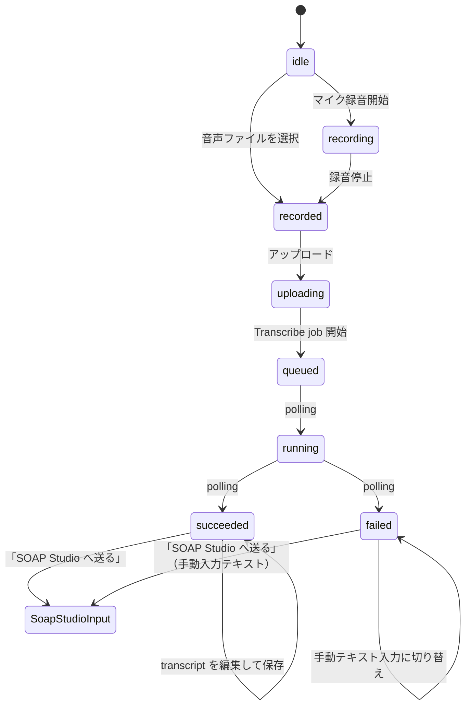

`succeeded` / `failed` いずれの経路でも「SOAP Studio へ送る」は `recordingId` を由来 tag として引き継ぐだけの session-local な handoff であり、DB 上のひも付けは行わない（issue #7 の Out of Scope。`App.tsx` の `soapSeed` state がこの引き継ぎを保持し、`activeNavId` を `"soap-studio"` に切り替える）。

### 既存: SOAP Studio（issue #5/#6）

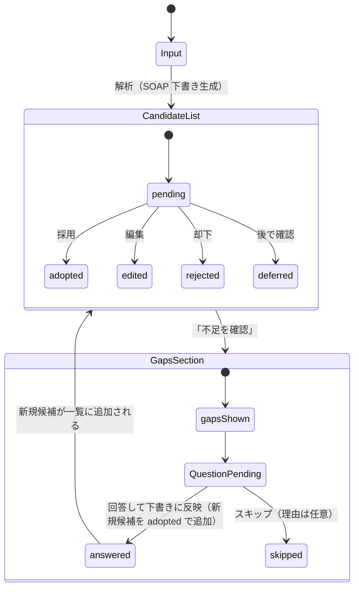

現状はここで終端で、`CandidateList` / `GapsSection` の状態はすべて session-local、正式記録への保存経路は存在しない（issue #5/#6 の Out of Scope）。

### 新規: SOAP Studio → 正式記録保存 → Knowledge Review（issue #8 の前提）

issue #8 のコメントは `soap_records` / `soap_record_versions`（本メモ「前提」節）を対象にするため、SOAP Studio に**今は存在しない**終端アクション「正式記録として保存」を追加する必要がある。

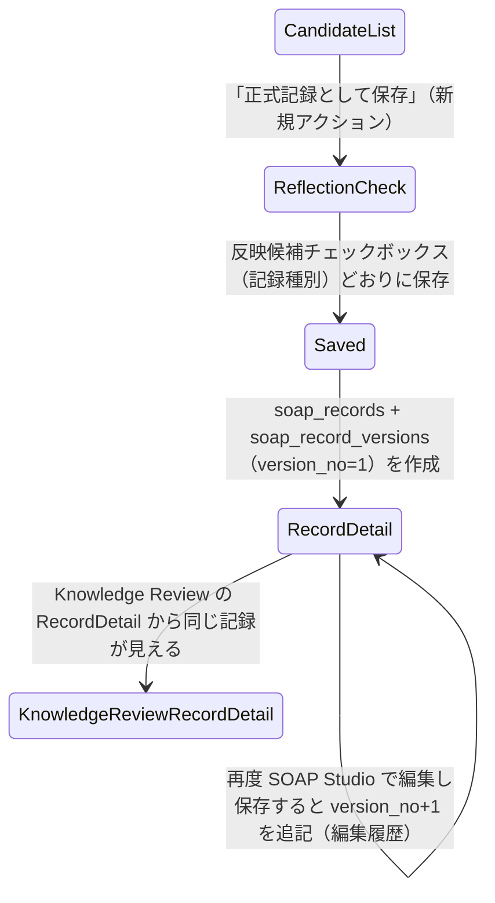

保存対象は `status` が `adopted`/`edited` の候補のみ（`rejected`/`deferred`/未対応の `pending` は含めない）。既存の反映候補チェックボックス（`recommendedRecordTypes` を初期値にした支援実績/汎用記録/会議/サマリーの選択、`src/features/soap-draft/model/reflection-selections.ts`）はそのまま `soap_records.record_type` の決定に使う。この保存アクションが無いと issue #8 の Acceptance Criteria（「対象記録、記録版、投稿者、投稿時刻と関連づけられる」）を満たす対象が存在しないため、issue #8 に着手する前に必ず実装する。

### シーケンス図: Voice Capture → SOAP Studio → 正式記録保存

上の3つの state 図を、実際に飛ぶ HTTP リクエスト単位で1本につなげたものが以下である。`/api/voice-recordings*` と `/api/soap-draft` は `packages/bff/adapters/{dev-server,lambda}.ts` に実在するルートで、`/api/soap-records` は前節の新規アクションのために追加が必要な未実装のルートである。

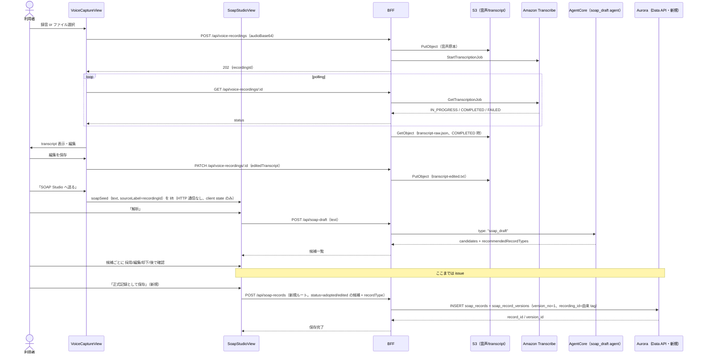

### Workspace Nav 全体とロール表示制御

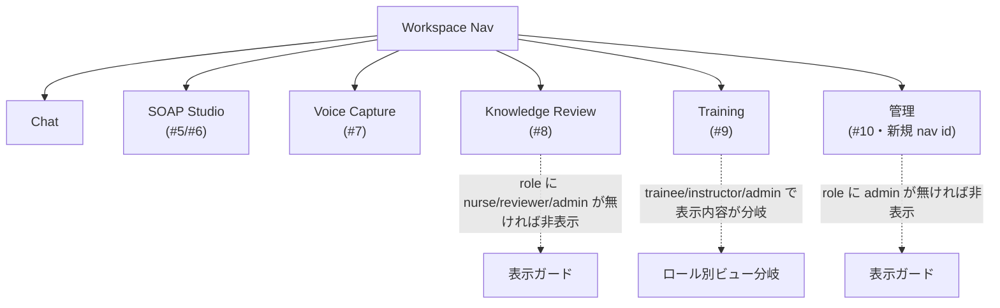

`roles` は `packages/bff/domain/auth.ts` の `authContextFromJwtClaims` 拡張（Cognito `cognito:groups` claim）で導出し、Workbench 側は BFF の `/api/me` 相当（未実装、新規追加が必要）でロールを取得して nav item の表示/非表示と画面内アクションの有効/無効を切り替える。

### Knowledge Review（issue #8）

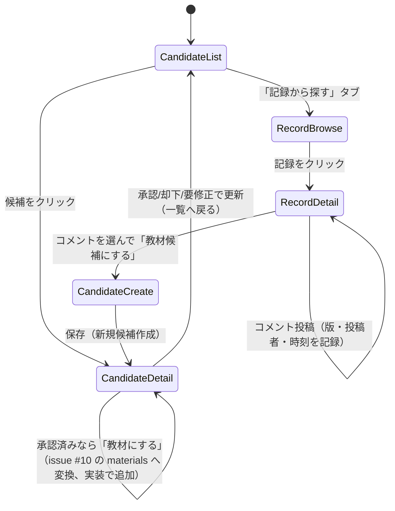

- `CandidateList`: `GET /api/material-candidates?specialty=&recordType=&learningTheme=&difficulty=&status=` で `material_candidates` を検索。既定フィルタは `status=candidate`。
- `CandidateDetail`: 紐づく `professional_comments`（`material_candidate_comments` 経由）を表示し、状態変更ボタン（`approved`/`rejected`/`needs_revision`）は role が `reviewer`/`admin` の時のみ有効化。却下時は `rejection_reason_code` の選択を必須にする。承認済み (`status: approved`) かつ未教材化（`material_id` 未設定）の場合は「教材にする」ボタンを表示し、`POST /api/material-candidates/{id}/promote-to-material` で issue #10 の `materials` へ変換する（実装時に追加。本メモの提案時点には無かった）。
- `RecordDetail`: `soap_record_versions` の版一覧とコメントスレッド。コメント投稿フォームは `comment_type`（review/correction_rationale/instruction_note/case_study）の選択を必須にする。
- `CandidateCreate`: 選択済みコメント ID 群を渡して `POST /api/material-candidates` を呼ぶモーダル。

### Training（issue #9）— 受講者(trainee) と指導者(instructor) でビュー分岐

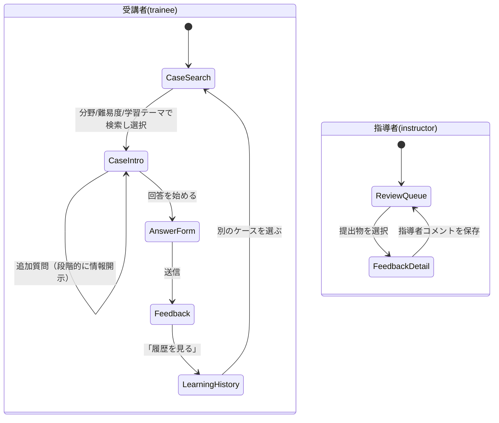

- `CaseSearch`: `GET /api/exercises?specialty=&difficulty=&learningTheme=` で公開済み（`materials.publication_status='published'`）の `exercise_cases` を検索。
- `CaseIntro`: `exercise_cases.initial_presentation` を表示し、`exercise_followup_questions` を1問ずつ開示（回答すると `revealed_info_text` が表示に追加される）。
- `AnswerForm`: SOAP / 追加確認事項への回答 / アセスメント / 支援方針の入力フォーム。送信で `POST /api/exercise-attempts`（`exercise_attempts` を作成、`status=submitted`）。
- `Feedback`: BFF が `exercise_attempts` の回答 + `exercise_model_answers` + 紐づく `rubrics`/`rubric_items` を集めて AgentCore の単発 agent（`soap_draft`/`soap_gaps` と同型、無状態）に渡し、応答を `exercise_feedback` に保存してから表示する。5軸（情報収集/根拠/アセスメント/支援方針/記録表現）と、単一正解ではなく複数の `exercise_model_answers` を並べて見せる。
- `LearningHistory`: 本人の `exercise_attempts` を集計した view（週次/分野別などの粒度は issue #9 の Open Question のため未確定）。
- `ReviewQueue` / `FeedbackDetail`: instructor 専用。`exercise_instructor_comments` の追加は `feedback_id` 単位。

### 管理（issue #10・新規 nav id、role: admin のみ）

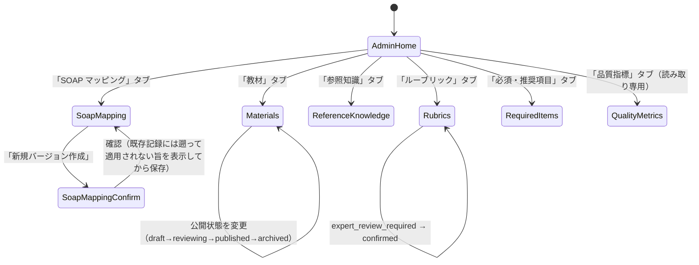

issue #10 自身が「初期は設定・seed から始め、必要なものだけ UI 化する」と明言しているため、タブはいずれも一覧+インライン編集にとどめ、複数ステップの wizard は `SoapMapping`（バージョン作成時に「既存記録へは遡及しない」ことを明示する確認ダイアログ）だけに絞る。`QualityMetrics` タブは `quality_metrics_definitions` の定義一覧と、各指標を集計する view の現在値を表示するだけの読み取り専用ビューにする（issue #10 の Acceptance Criteria は「項目が定義されていること」までが範囲で、目標値・合格ラインの設定は Out of Scope）。

## issue の Open Questions とスキーマ側の対応

| issue | Open Question | スキーマ側の対応方針 |
| --- | --- | --- |
| #8 | 教材候補の承認者ロール | `approver_id` は `app_users` への FK のみ持ち、ロール判定は BFF の認可ロジック側に置く（DB に承認者ロールをハードコードしない） |
| #8 | コメントの編集履歴保持範囲 | `professional_comment_revisions` を編集時のみ追記する設計にし、「編集不可」でも「全履歴保持」でもスキーマ変更なしに対応 |
| #8 | 教材候補の却下理由の分類 | `rejection_reason_code` は `rejection_reason_codes` マスタ（issue #10 管理）への FK にして、コード自体は後決め |
| #9 | 演習ケースの初期件数 | スキーマには影響しない（`materials.publication_status='draft'` で件数を絞って seed 可能） |
| #9 | 受講者/指導者ロールの権限 | `app_users.roles` を汎用配列にし、権限境界は BFF 側の認可ロジックに委ねる |
| #9 | 弱点傾向の集計粒度 | 専用テーブルを持たず view にすることで、GROUP BY 軸の変更を後から無停止で変えられる |
| #10 | ルーブリック確定時の承認フロー | `rubrics.review_status` の `expert_review_required → confirmed` 遷移イベントテーブル（`material_candidate_status_events` と同型）を後から追加できる形にしておく |
| #10 | 管理者ロールの範囲 | Cognito Group `admin` を用意するのみで、細分化（教材管理者/ルーブリック管理者等）は後からグループを増やすだけで対応可能 |
| #10 | 参照知識の更新頻度 | `reference_knowledge` は `external_kb_ref` で既存 vector KB を参照するだけなので、更新頻度は KB ingestion 側の運用判断に委ねられ、このテーブル自体は影響を受けない |

## 実装順序の提案

1. ✅ **前提整備**: `soap_records` / `soap_record_versions`（正式記録・編集履歴の永続化）、および SOAP Studio への「正式記録として保存」アクション追加（前節「新規: SOAP Studio → 正式記録保存 → Knowledge Review」）。これがないと issue #8 のコメントが「対象記録」を持てない。実装済み（`app_users` のロールミラーは前述のとおり未実装）。
2. ✅ **issue #10 の最小構成**: `materials` / `rubrics` / `reference_knowledge` / `soap_mapping_versions` / `required_recommended_items` / 3マスタ（specialty/learning_theme/difficulty）。issue #10 自身が「設定と seed から始める」と明言しており、他2 issue の土台になる。実装済み（`reference_knowledge` は read-only）。
3. ✅ **issue #8**: `professional_comments` / `material_candidates` とその周辺。実装済み（`promote-to-material` を追加）。
4. ⬜ **issue #9**: `exercise_cases` 以下。issue #8/#10 の土台の上に乗るため最後にする。未着手（Training 画面は dummy データのまま）。

## 未決定事項（この提案で選ばなかった代替案）

- **DynamoDB を主データストアにする案**は不採用とした。ただし `exercise_attempts` のような高頻度・単純キー書き込みだけを DynamoDB に分離し、検索・集計が必要な部分だけ Aurora に置く「ポリグロット永続化」も選択肢としてはあり得る。PoC 規模でその複雑さに見合うメリットがあるかは要判断。
- **ORM 導入の有無**は上述の通り未決定。
- **Postgres Row Level Security の採用時期**は、ロール要件（issue #8/#9/#10 の Open Questions）が固まってから判断する方が手戻りが少ないと考え、初期実装ではアプリケーション層認可のみを提案した。
