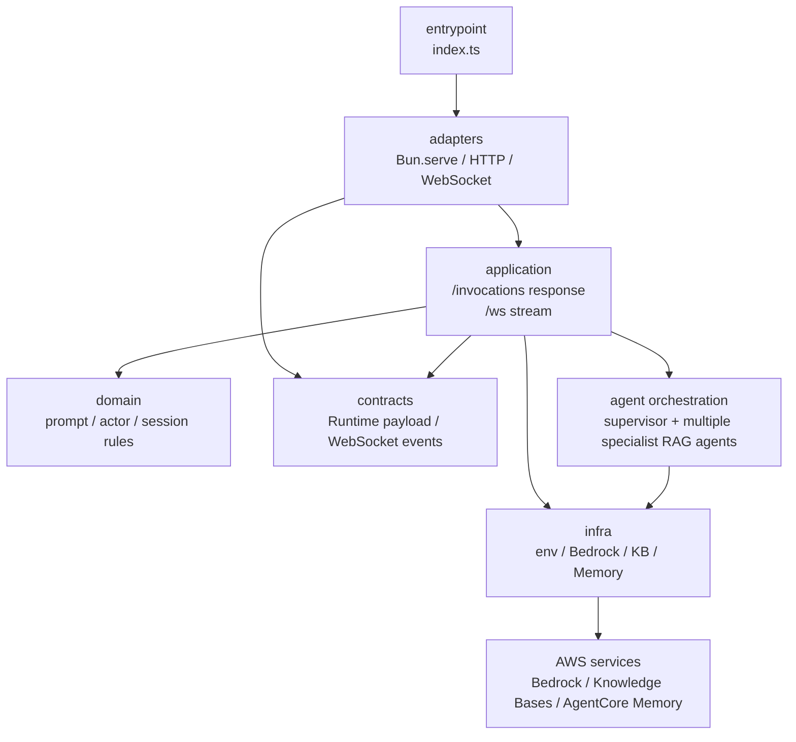
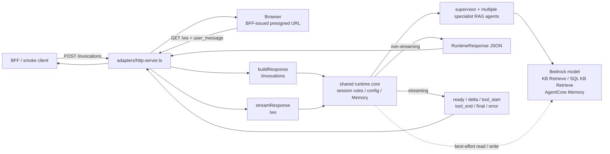

# packages/agentcore

`packages/agentcore` は Amazon Bedrock AgentCore Runtime として動く HTTP / WebSocket service です。user prompt / actor ID / session ID を取り出し、supervisor + 複数の専門 RAG agent を実行します。

公開する endpoint:

- `GET /ping` — health check
- `POST /invocations` — non-streaming JSON 応答用の互換 / fallback path
- `GET /ws` — WebSocket upgrade による streaming chat path（Chat UI の本線）

認証・URL 発行・HTTP contract 変換は `packages/bff` の責務で、本ディレクトリは AgentCore Runtime contract / WebSocket stream adapter / agent orchestration / Knowledge Base retrieval / Memory 連携を担います。

## Entry Point

`index.ts` が AgentCore Runtime の root wrapper です。`adapters/http-server.ts` を公開し、`bun run build:agentcore` で `dist/agentcore/agentcore.mjs` に bundle されます。

AgentCore Runtime は source entrypoint が1つなので、root には用途名ではなく `index.ts` を置いています。複数の runtime entrypoint が増えた場合は、BFF と同じく用途名の wrapper に分けます。

## ローカル実行と env

ローカル実行は repo ルートから `mise run dev:agentcore`（packages/agentcore に cd して `bun index.ts`）で起動し、build 済み artifact は `mise run start:agentcore`（`dist/agentcore/agentcore.mjs`）で起動します。どちらも `packages/agentcore/.env` を読み込みます。

`packages/agentcore/.env.example` が local AgentCore Runtime 用の env を所有します。`.env` にコピーして値を埋めて使います（`.env` は gitignore 済み。`infra/config.ts` が読み取りを一元化します）。

Vector KB ID / support_activity SQL KB ID / Memory ID は `terraform -chdir=terraform/aws/agentcore output knowledge_base_ids`、`terraform -chdir=terraform/aws/agentcore output support_activity_knowledge_base_id`、`terraform -chdir=terraform/aws/agentcore output memory_id` の値を転記します。`LAW_HIERARCHICAL_KB_ID` は `law` corpus の chunking 比較用で、通常の `law_rag_agent` は引き続き `LAW_KB_ID` を使います。`SUPPORT_ACTIVITY_KB_ARN` は `SUPPORT_ACTIVITY_INCLUDE_GENERATED_SQL=true` で GenerateQuery debug output を使う場合だけ、`terraform -chdir=terraform/aws/agentcore output support_activity_knowledge_base_arn` の値を転記します。本番（AgentCore Runtime）は Terraform が `environment_variables` として供給するため、この `.env` はローカル実行専用です。

`packages/agentcore/.env` の KB ID / Memory ID は、`mise run dev:agentcore` / `mise run start:agentcore` で起動した local process が読むための値です。`bun run build:agentcore` や `Dockerfile.agentcore` の image build には取り込まれず、Terraform の deploy 環境にも反映されません。

`support_activity` は local / deployed runtime とも Terraform が作る Bedrock SQL Knowledge Base を `Retrieve` で引きます。DuckDB は `bun run structured-data:generate:support-activity` が committed synthetic CSV / Parquet を生成するためだけに使い、AgentCore Runtime には組み込みません。

deploy された AgentCore Runtime の env は Terraform 側の `terraform/aws/agentcore/locals.tf` の `local.runtime_env` が source of truth です。複数の専門 agent の Knowledge Base ID、support_activity SQL Knowledge Base ID / optional ARN、AgentCore Memory ID は Terraform が管理する `aws_bedrockagent_knowledge_base.this[...]` / `aws_bedrockagent_knowledge_base.support_activity` / `aws_bedrockagentcore_memory.this.id` から設定されるため、deploy 側の値を変える場合は `.env` ではなく Terraform 管理の resource / input / import 方針を変更します。

## Layers

| Path | Responsibility |
| --- | --- |
| `adapters/` | AgentCore Runtime の HTTP / WebSocket contract へ適合する層。`Bun.serve`、`/ping`、`/invocations`、`/ws` upgrade、binary JSON decode、WebSocket message validation、HTTP / WebSocket response 化、例外の封じ込めを担います。 |
| `application/` | Runtime の use case。設定確認、履歴取得、supervisor 実行 / stream 実行、stream event 変換、Memory 保存、specialist agent / tool 構成、model response からの本文抽出を担います。 |
| `contracts/` | Runtime request/response、WebSocket input/output event、adapter から application へ渡す `Responder` seam を定義します。 |
| `domain/` | Runtime payload に閉じた純粋なルール。prompt / actor / session の取り出しと、履歴付き supervisor message の組み立てを担います。 |
| `infra/` | AWS / Strands / env に接続する実装。Bedrock model、Knowledge Base Retrieve、support_activity structured-data providers、AgentCore Memory、runtime env config を担います。 |

## Dependency Direction

依存の基本方針は、AgentCore HTTP / WebSocket contract を `adapters` に閉じ、会話処理を `application` に集約することです。`domain` は payload 由来の純粋な session rule、`contracts` は Runtime / WebSocket の data shape、`infra` は AWS SDK / Strands SDK / env に触れる実装だけを持ちます。

agent orchestration は `application` 配下にあり、supervisor と複数の専門 RAG agent を組み立てます。file 単位の詳細は、下の `Runtime Flows` と `File Map` を参照します。

## Runtime Flows

`/invocations` と `/ws` は adapter で分岐しますが、prompt / actor / session の検証、env config、Memory、supervisor + 複数の専門 RAG agent は共通の runtime core を使います。違いは response shape で、`/invocations` は1つの JSON を返し、`/ws` は `ready`、`delta`、`tool_start`、`tool_end`、`final`、`error` の browser event を返します。Memory の読み書きは best-effort で、失敗しても会話自体は止めません。

## File Map

| File | Summary |
| --- | --- |
| `index.ts` | root wrapper。`handleRequest` / `startAgentCoreServer` を公開し、直接実行時は server を起動します。 |
| `adapters/http-server.ts` | AgentCore Runtime HTTP / WebSocket contract を `Bun.serve` で実装し、`/invocations` を `buildResponse`、`/ws` message を `streamResponse` に委譲します。 |
| `application/build-response.ts` | 設定確認、prompt 検証、履歴取得、supervisor 実行、Memory 保存、Runtime response 作成を担います。 |
| `application/build-stream-response.ts` | WebSocket streaming 用の設定確認、prompt 検証、履歴取得、`supervisor.stream()` 実行、Memory 保存、browser event 送信を担います。 |
| `application/stream-events.ts` | Strands stream event を browser 向け `delta` / `tool_start` / `tool_end` event に変換します。 |
| `application/agent-deps.ts` | agent 組み立て時の依存注入 contract と model 解決を定義します。 |
| `application/specialists/database-agent.ts` | database 専門 RAG agent と supervisor 用 tool 変換を定義します。 |
| `application/specialists/document-agent.ts` | document 専門 RAG agent と supervisor 用 tool 変換を定義します。 |
| `application/specialists/law-agent.ts` | law（児童虐待防止法）専門 RAG agent と supervisor 用 tool 変換を定義します。 |
| `application/specialists/medical-care-law-agent.ts` | medical_care_law（保険診療基本法令テキストブック）専門 RAG agent と supervisor 用 tool 変換を定義します。 |
| `application/specialists/support-activity-agent.ts` | support_activity（住民台帳・世帯・支援ケース・活動ログの synthetic structured data）専門 agent と supervisor 用 tool 変換を定義します。 |
| `application/supervisor-agent.ts` | 専門 tool を束ねた supervisor agent を組み立てます。 |
| `application/message-text.ts` | Strands `Message` から user-facing な `textBlock` だけを連結して取り出します。 |
| `contracts/runtime.ts` | AgentCore Runtime の入力 / 出力 JSON と `Responder` seam を定義します。 |
| `contracts/websocket.ts` | Browser から受ける `user_message` / `ping` と、AgentCore から返す stream event contract を定義します。 |
| `domain/session.ts` | prompt / actor ID / session ID の取り出しと、履歴付き supervisor message の組み立てを定義します。 |
| `infra/config.ts` | Bedrock model ID、複数の KB ID、support_activity SQL KB ID / optional ARN、Memory ID、region、retrieval 件数を env から読み取ります。 |
| `infra/knowledge-base.ts` | AWS SDK v3 の `RetrieveCommand` と Strands `tool()` を使い、専用 KB 検索 tool を作ります。 |
| `infra/structured-data.ts` | support_activity structured-data RAG 用の provider seam と Strands `query_structured_data` tool を定義します。 |
| `infra/structured-data-bedrock.ts` | Bedrock SQL Knowledge Base の `Retrieve` と optional `GenerateQuery` debug output を provider に閉じます。 |
| `infra/memory.ts` | AgentCore Memory の `CreateEvent` / `ListEvents` を使い、直近履歴の取得と今回ターンの保存を行います。 |
| `infra/model.ts` | `Config` から Strands `BedrockModel` を生成します。 |
| `evaluation/law-kb-comparison.ts` | 同一 query を現行 `law` KB と `law_hierarchical` KB に `Retrieve` し、JSON で比較出力する dev / evaluation CLI です。 |

## Change Guide

- AgentCore HTTP endpoint、status code、decode / response 化を変える場合は `adapters/http-server.ts` と `contracts/runtime.ts` を先に見ます。
- WebSocket endpoint、upgrade context、browser event contract、message size / validation を変える場合は `adapters/http-server.ts` と `contracts/websocket.ts` を先に見ます。
- Runtime payload、prompt / actor / session の扱いを変える場合は `contracts/runtime.ts` と `domain/session.ts` を更新し、`application/build-response.ts` / `application/build-stream-response.ts` の利用箇所を合わせます。
- Strands stream event から browser event への表示内容を変える場合は `application/stream-events.ts` と Chat UI 側の `packages/chat-ui/websocket-chat.ts` を合わせます。
- supervisor の system prompt や専門 tool の束ね方を変える場合は `application/supervisor-agent.ts` を見ます。
- 複数の専門 agent の構成、tool 名、system prompt、KB / structured-data provider 割り当てを変える場合は `application/specialists/` 配下の該当 domain file と `infra/config.ts` を合わせます。
- support_activity の Bedrock SQL KB を変える場合は `infra/structured-data*.ts`、`infra/config.ts`、`terraform/aws/agentcore/structured-data.tf` / `redshift-spectrum.tf` を合わせます。
- KB retrieval の client、検索件数、整形を変える場合は `infra/knowledge-base.ts` を見ます。
- `law` KB の chunking 比較を行う場合は `evaluation/law-kb-comparison.ts` と `LAW_HIERARCHICAL_KB_ID` を使います。通常回答経路を切り替える変更ではありません。
- Memory の履歴件数、整形、保存 payload、ページングを変える場合は `infra/memory.ts` を見ます。
- model ID / region / env の追加や必須設定の変更は `infra/config.ts` と Terraform の runtime env を合わせます。
