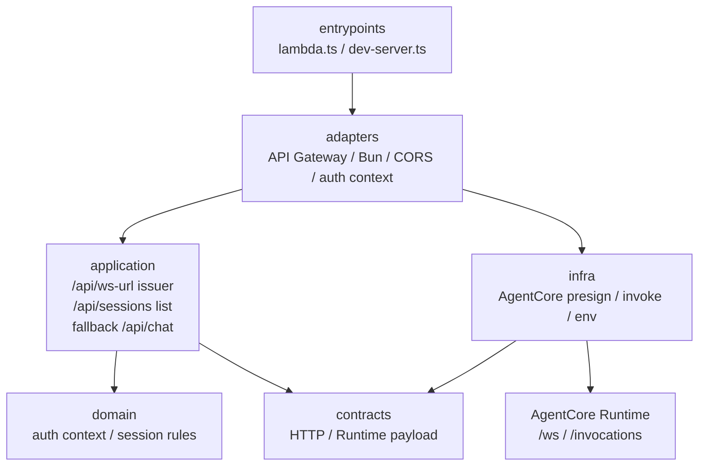
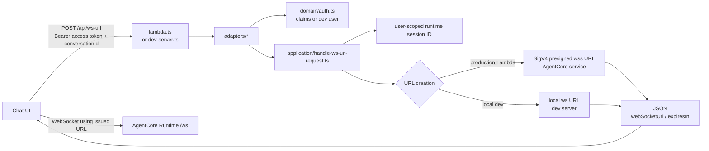
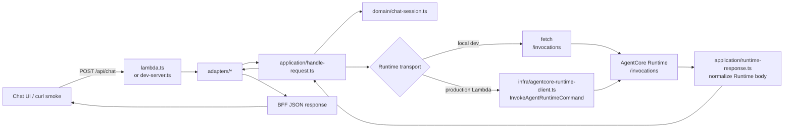
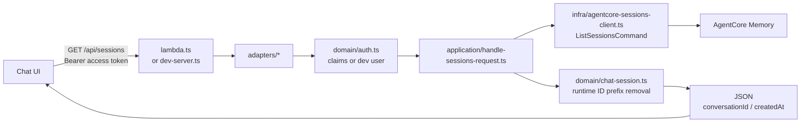
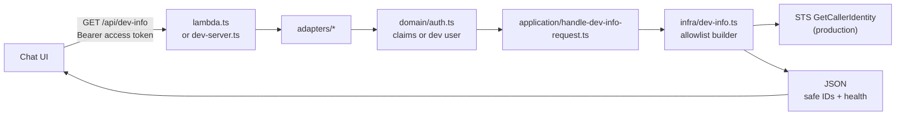

# packages/bff

`packages/bff` は Chat UI / API Gateway と AgentCore Runtime の間に置く BFF です。agent orchestration、RAG、Memory は `packages/agentcore` 側の責務で、ここでは HTTP request の受け口、Chat UI contract の検証、JWT / local dev auth からの user context 導出、AgentCore `/ws` 用の短命 presigned WebSocket URL 発行、fallback 用 Runtime invoke の payload 変換と response 整形だけを扱います。

通常の Chat UI は `POST /api/ws-url` で BFF を必ず通り、BFF-derived user / actor / runtime session context を含む短命 WebSocket URL を受け取ります。stream 本体は BFF relay ではなく、その URL で browser が AgentCore Runtime `/ws` へ接続します。左ペイン用の `GET /api/sessions` は同じ認証済み actor だけを対象に AgentCore Memory `ListSessions` を呼び、browser `conversationId` と作成日時だけを返します。既存の `POST /api/chat` は non-streaming fallback / smoke path です。開発補助の `GET /api/dev-info` は同じ認証境界の内側で、AWS / Runtime / BFF / Auth の allowlist 済み識別子だけを返します。

このディレクトリは Bun workspace `@wel-agents-poc/bff` です。runtime 依存（`@aws-sdk/client-bedrock-agentcore` / `@aws-sdk/client-sts` / `@aws-sdk/core` / `@aws-sdk/credential-provider-node` / `@aws-crypto/sha256-js` / `@smithy/signature-v4` / `@smithy/types`）と `build` スクリプトは `package.json` が所有します（横断ツールと単一 `bun.lock` はルート）。

## Entry Points

| File | Role |
| --- | --- |
| `lambda.ts` | production Lambda artifact の root wrapper。`adapters/lambda.ts` を公開し、`bun run build:bff` で `dist/bff-lambda/index.mjs` に bundle されます。 |
| `dev-server.ts` | local BFF server の root wrapper。`adapters/dev-server.ts` を公開し、`mise run dev:bff` / `mise run start:bff` の入口になります。 |

BFF には production Lambda と local server の2つの source entrypoint があるため、generic な `index.ts` ではなく用途名を file name に残しています。

## ローカル実行と env

ローカル実行は repo ルートから `mise run dev:bff`（packages/bff に cd して `bun dev-server.ts`）で起動し、build 済み artifact は `mise run start:bff`（`dist/bff-dev-server/index.mjs`）で起動します。どちらも `packages/bff/.env` を読み込みます。

`packages/bff/.env.example` が **local BFF dev server** 用の env を所有します（すべて任意。`.env` にコピーして使う。`.env` は gitignore 済み。`adapters/dev-server.ts` の `resolveBffDevConfig` が読み取ります）。

**production Lambda の env はここには置きません。** `AGENT_RUNTIME_ARN`、`AGENT_RUNTIME_REGION`、`AGENT_RUNTIME_QUALIFIER`、`REQUEST_TIMEOUT_MS`、`WS_URL_EXPIRES_SECONDS`、`BFF_ACTOR_CLAIM` / `BFF_USER_ID_CLAIM` などの deployed Lambda 設定は `terraform/aws/bff`（`terraform.tfvars` → Lambda `environment`）が供給し、`infra/lambda-config.ts` が読み取ります。

## Layers

| Path | Responsibility |
| --- | --- |
| `adapters/` | 外部 runtime の shape を BFF core に合わせる層。Lambda adapter は API Gateway event / JWT authorizer claims、dev server adapter は Bun `Request` / CORS / local dev auth / local fetch を扱います。 |
| `application/` | hosting に依存しない BFF use case。`/api/ws-url` の request validation / URL issuer、`/api/sessions` の認証済み actor session list、fallback `/api/chat` の Runtime payload 変換、`/api/dev-info` の認証必須化、Runtime response の正規化を担います。 |
| `contracts/` | adapter / application / infra 間で共有する data contract。HTTP request/response と Runtime invoke result を定義します。 |
| `domain/` | auth / chat session に閉じた純粋なルール。JWT claims からの authenticated context 導出、user-scoped runtime session ID 導出、conversation ID の生成・検証、文字列 field の取り出しを担います。 |
| `infra/` | AWS SDK や Lambda env など外部環境に接続する実装。AgentCore Runtime invoke、AgentCore `/ws` presigned URL 生成、AgentCore Memory `ListSessions`、Dev Info response 生成、production 設定の読み取りを担います。 |

## Dependency Direction

依存の基本方針は、外側の実行環境を `entrypoints` / `adapters` / `infra` に閉じ込め、共通の BFF behavior を `application` に集約することです。`domain` は認証 context と session rule、`contracts` は層間 data shape だけを持ち、AgentCore Runtime への接続は `infra` が引き受けます。

file 単位の詳細は、下の `Request Flows` と `File Map` を参照します。

## Request Flows

### WebSocket URL Issuer

`POST /api/ws-url` は URL issuer のみを担います。BFF は JWT claims または dev user から user / actor context を導出し、browser から受けた `conversationId` と組み合わせて user-scoped runtime session ID を作ります。返却する WebSocket URL は短命で、production では最大300秒です。presigned URL は一時的な認証情報を含むため、ログやチケットに貼りません。

### Non-Streaming Fallback

`handleBffRequest` は `RuntimeInvoker` を引数で受け取るため、production Lambda と local server は fallback `/api/chat` の validation / response shaping を共有します。差し替わるのは Runtime を呼ぶ transport だけです。

### Session List

`GET /api/sessions` は authenticated actor だけを対象に AgentCore Memory `ListSessions` を呼びます。BFF が `/api/ws-url` で付与した user-scoped runtime session ID prefix を外し、Chat UI が再利用できる browser `conversationId` と `createdAt` だけを返します。event 本文、raw Memory event、presigned URL は返しません。`DEV_INFO_AGENTCORE_MEMORY_ID` が未設定の場合は `503` を返します。

### Dev Info

`GET /api/dev-info` は認証済み context を必須にし、raw env、Terraform state、credential、token、
presigned URL を返しません。production では STS `GetCallerIdentity` の account ID を優先し、失敗時は
AgentCore Runtime ARN から account ID を補完します。local dev では `AGENTCORE_RUNTIME_URL` の `/ping` を
軽量に確認し、production Runtime health は安全な probe を設計するまで `not_checked` とします。

## File Map

| File | Summary |
| --- | --- |
| `adapters/dev-server.ts` | `Bun.serve` で `/ping`、`/api/ws-url`、`/api/sessions`、`/api/dev-info`、fallback `/api/chat` を公開します。`/api/ws-url` は local `/ws` URL を返し、`/api/sessions` は configured Memory ID がある時だけ AWS `ListSessions` を呼び、`/api/dev-info` は local Runtime `/ping` を確認し、`/api/chat` は local AgentCore Runtime へ `fetch` で forward します。 |
| `adapters/lambda.ts` | API Gateway event を受け、`/api/ws-url`、`/api/sessions`、`/api/dev-info` は JWT claims から認証 context を作って application handler に委譲し、fallback `/api/chat` は AgentCore Runtime SDK client を注入して `handleBffRequest` を呼びます。 |
| `application/handle-dev-info-request.ts` | `GET /api/dev-info` の routing、auth context 必須化、Dev Info provider 呼び出し、HTTP response 作成を担います。 |
| `application/handle-sessions-request.ts` | `GET /api/sessions` の routing、auth context 必須化、Memory ID 設定確認、AgentCore session summary から browser `conversationId` への変換を担います。 |
| `application/handle-ws-url-request.ts` | `POST /api/ws-url` の JSON parse、auth context 必須化、conversationId 検証、user-scoped runtime session ID 導出、WebSocket URL 発行 response 作成を担います。 |
| `application/handle-request.ts` | fallback `/api/chat` の routing、JSON parse、message / conversationId 検証、Runtime payload 作成、HTTP response 作成を担います。 |
| `application/runtime-response.ts` | AgentCore Runtime の JSON / event stream / text response を fallback `/api/chat` client 向け payload に整形します。 |
| `contracts/dev-info.ts` | Chat UI に返す Dev Info の allowlist contract と health status を定義します。 |
| `contracts/http.ts` | adapter が application に渡す最小 HTTP contract と、application が返す Lambda 互換 response を定義します。 |
| `contracts/runtime.ts` | AgentCore Runtime へ送る payload、invoke result、transport seam を定義します。 |
| `contracts/sessions.ts` | AgentCore session summary と Chat UI に返す session list response を定義します。 |
| `domain/auth.ts` | JWT claims または dev user から BFF-authenticated user / actor context を作り、runtime session ID 導出を re-export します。 |
| `domain/chat-session.ts` | conversation ID の生成・検証、user-scoped runtime session ID の導出 / prefix 復元、unknown payload からの text 抽出を定義します。 |
| `infra/agentcore-sessions-client.ts` | AWS SDK v3 の `ListSessionsCommand` を組み立て、AgentCore Memory session summary を BFF contract に正規化します。 |
| `infra/agentcore-websocket-presigner.ts` | AgentCore Runtime `/ws` へ接続する SigV4 presigned WebSocket URL を生成し、BFF-derived session / user / actor context を query に含めます。 |
| `infra/agentcore-runtime-client.ts` | AWS SDK v3 の `InvokeAgentRuntimeCommand` を組み立て、SDK response を `RuntimeInvokeResult` に正規化します。 |
| `infra/dev-info.ts` | Lambda env / request context / STS caller identity から安全な Dev Info response を組み立てます。 |
| `infra/lambda-config.ts` | production Lambda 用の必須 env、JWT/dev auth mode、claim 名、WebSocket URL 有効秒数、Dev Info 表示用 env、既定値を `LambdaConfig` に変換します。 |

## Change Guide

- Chat UI が BFF に送る WebSocket URL issuer contract や HTTP status を変える場合は `application/handle-ws-url-request.ts`、`domain/auth.ts`、`contracts/http.ts` を先に見ます。
- Chat UI 左ペイン用の AWS session list contract を変える場合は `application/handle-sessions-request.ts`、`infra/agentcore-sessions-client.ts`、`contracts/sessions.ts`、Terraform の BFF route / IAM、`packages/chat-ui/sessions-api.ts` を合わせます。
- WebSocket presigned URL の署名、query parameter、有効秒数、AgentCore custom context を変える場合は `infra/agentcore-websocket-presigner.ts` と `packages/agentcore/adapters/http-server.ts` を合わせます。
- JWT claim 名、dev auth mode、Lambda env を変える場合は `infra/lambda-config.ts`、`domain/auth.ts`、Terraform の BFF env / JWT authorizer 設定を合わせます。
- fallback `/api/chat` の Runtime payload や invoke result の shape を変える場合は `contracts/runtime.ts` を更新し、`application/handle-request.ts` と `infra/agentcore-runtime-client.ts` の両方を合わせます。
- Dev Info の表示項目を変える場合は `contracts/dev-info.ts`、`infra/dev-info.ts`、`packages/chat-ui/dev-info.ts`、Terraform の BFF env、docs を合わせます。credential、token、presigned URL、raw env は返しません。
- local server だけの CORS / port / forward 先 / local WebSocket URL を変える場合は `adapters/dev-server.ts` に閉じます。
- production Lambda の SDK invoke 設定を変える場合は `infra/lambda-config.ts` と `infra/agentcore-runtime-client.ts` に閉じます。
