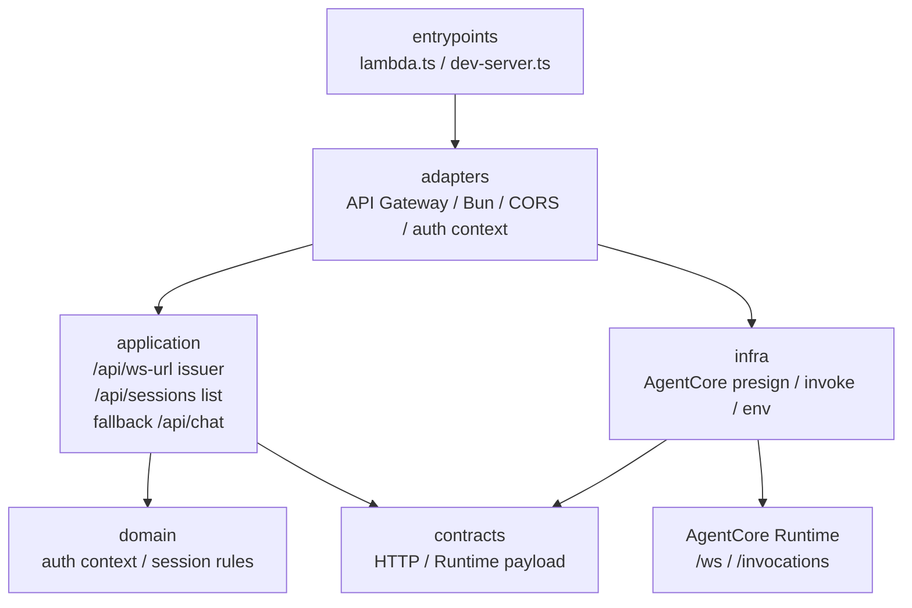
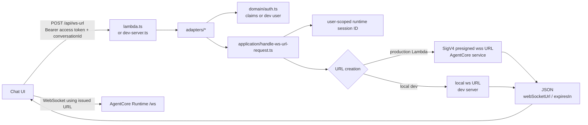
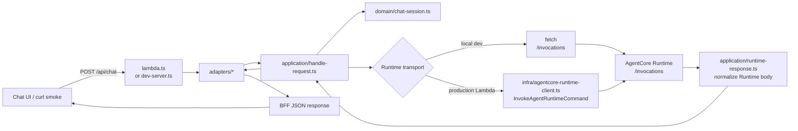
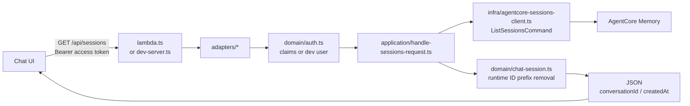
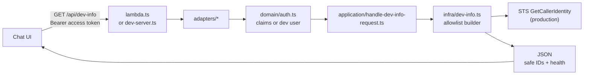
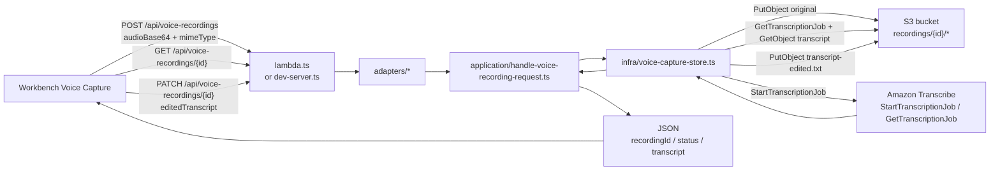

# packages/bff

`packages/bff` は Chat UI / API Gateway と AgentCore Runtime の間に置く BFF です。agent orchestration、RAG、Memory は `packages/agentcore` 側の責務で、ここでは HTTP request の受け口、Chat UI contract の検証、JWT / local dev auth からの user context 導出、AgentCore `/ws` 用の短命 presigned WebSocket URL 発行、fallback 用 Runtime invoke の payload 変換と response 整形だけを扱います。

通常の Chat UI は `POST /api/ws-url` で BFF を必ず通り、BFF-derived user / actor / runtime session context を含む短命 WebSocket URL を受け取ります。stream 本体は BFF relay ではなく、その URL で browser が AgentCore Runtime `/ws` へ接続します。左ペイン用の `GET /api/sessions` は同じ認証済み actor だけを対象に AgentCore Memory `ListSessions` を呼び、browser `conversationId` と作成日時だけを返します。既存の `POST /api/chat` は non-streaming fallback / smoke path です。開発補助の `GET /api/dev-info` は同じ認証境界の内側で、AWS / Runtime / BFF / Auth の allowlist 済み識別子だけを返します。`POST /api/soap-draft` は `packages/workbench` の SOAP Studio（issue #5）から呼ばれる、chat とは独立した一回限りの SOAP 分類 request で、client からの conversationId を受け取らず呼び出しごとに新しい runtime session ID を生成します。`POST /api/soap-gaps` も同じく SOAP Studio（不足確認、issue #6）から呼ばれる一回限りの request で、`/api/soap-draft` の出力（SOAP 下書き候補）を `candidates` として受け取り、検出した不足一覧と確認質問を返します。`POST /api/voice-recordings` + `GET /api/voice-recordings/{recordingId}` + `PATCH /api/voice-recordings/{recordingId}` は Voice Capture（issue #7）用で、AgentCore Runtime を経由せず、BFF が S3 への音声保存と Amazon Transcribe の非同期文字起こし job を直接呼び出します。`POST /api/soap-records` + `GET /api/soap-records` + `GET /api/soap-records/{recordId}/versions` は SOAP Studio の「正式記録として保存」（issue #8 の前提）用で、AgentCore Runtime を経由せず、BFF が Aurora Serverless v2 (PostgreSQL) を RDS Data API で直接読み書きします（`soap_records` / `soap_record_versions`）。`POST /api/professional-comments` + `GET /api/professional-comments` は専門職コメント（issue #8）用で、正式記録の特定版へのコメントを作成・一覧取得します（`professional_comments`）。`GET /api/material-candidates` + `POST /api/material-candidates` + `PATCH /api/material-candidates/{id}/status` は教材候補（issue #8）用で、分野・記録種別・学習テーマ・難易度・状態での検索、選択した専門職コメントを束ねた候補作成、承認/却下/要修正の状態遷移（承認 gate）を担います（`material_candidates` / `material_candidate_comments` / `material_candidate_status_events`）。`POST /api/material-candidates/{id}/promote-to-material` は承認済みの候補を issue #10 の `materials`（教材種別: `comment_derived_note`、status: draft）に変換し、`material_candidates.material_id` で紐づけます（未承認や再変換は `400`）。管理画面（issue #10）用に `GET /api/materials` + `POST /api/materials` + `PATCH /api/materials/{id}/status`（教材の公開状態、`materials` / `material_revisions`）、`GET /api/rubrics` + `POST /api/rubrics` + `PATCH /api/rubrics/{id}/review-status`（評価ルーブリック、`rubrics` / `rubric_items`）、`GET /api/reference-knowledge`（参照知識、read-only、`reference_knowledge`）、`GET /api/soap-mapping-versions` + `POST /api/soap-mapping-versions`（SOAP マッピングのバージョン管理、`soap_mapping_versions`。既存記録には遡って適用しない）、`GET /api/required-items` + `POST /api/required-items`（必須推奨項目、`required_recommended_items`）、`GET /api/quality-metrics`（品質指標の定義、read-only、`quality_metrics_definitions`）も同様に用意する。新人保健師向け演習（issue #9）用に `GET /api/exercise-cases` + `GET /api/exercise-cases/{id}`（公開済み演習ケース、分野・難易度・学習テーマ filter、`exercise_cases` / `exercise_followup_questions` / `exercise_model_answers`。評価観点は `exercise_case_rubrics` → `rubrics` 経由で埋め込む）、`POST /api/exercise-attempts` + `GET /api/exercise-attempts?scope=mine|instructor-queue` + `PATCH /api/exercise-attempts/{id}/reveal-followup` + `PATCH /api/exercise-attempts/{id}/draft-answers` + `POST /api/exercise-attempts/{id}/submit`（演習の開始・追加質問の開示・回答の保存・提出、`exercise_attempts`。提出時は `packages/agentcore` の `exercise_feedback_agent`（soap_draft/soap_gaps と同型の一回限り AgentCore Runtime invoke）へ回答と模範回答・評価観点を渡し、生成されたフィードバックを `exercise_feedback` に保存する。AgentCore invoke 失敗時も提出自体（`submitted`）は残す）、`POST /api/instructor-comments`（指導者コメント、`exercise_instructor_comments`）を用意する。`ExerciseAttempt` は紐づく `ExerciseCase` と最新の `ExerciseFeedback`（`instructorComments` を含む）を1回の select に埋め込んで返すため、client 側の追加 fetch は不要。上記いずれも認証済み user context（`created_by` / `author_id` / `changed_by` のいずれかに必須な endpoint を含む）を必須にするため、`authContext` が無い request は `401` を返す。

このディレクトリは Bun workspace `@wel-agents-poc/bff` です。runtime 依存（`@aws-sdk/client-bedrock-agentcore` / `@aws-sdk/client-s3` / `@aws-sdk/client-sts` / `@aws-sdk/client-transcribe` / `@aws-sdk/core` / `@aws-sdk/credential-provider-node` / `@aws-crypto/sha256-js` / `@smithy/signature-v4` / `@smithy/types`）と `build` スクリプトは `package.json` が所有します（横断ツールと単一 `bun.lock` はルート）。

## Entry Points

| File | Role |
| --- | --- |
| `lambda.ts` | production Lambda artifact の root wrapper。`adapters/lambda.ts` を公開し、`bun run build:bff` で `dist/bff-lambda/index.mjs` に bundle されます。 |
| `dev-server.ts` | local BFF server の root wrapper。`adapters/dev-server.ts` を公開し、`mise run dev:bff` / `mise run start:bff` の入口になります。 |

BFF には production Lambda と local server の2つの source entrypoint があるため、generic な `index.ts` ではなく用途名を file name に残しています。

## ローカル実行と env

ローカル実行は repo ルートから `mise run dev:bff`（packages/bff に cd して `bun dev-server.ts`）で起動し、build 済み artifact は `mise run start:bff`（`dist/bff-dev-server/index.mjs`）で起動します。どちらも `packages/bff/.env` を読み込みます。

`packages/bff/.env.example` が **local BFF dev server** 用の env を所有します（すべて任意。`.env` にコピーして使う。`.env` は gitignore 済み。`adapters/dev-server.ts` の `resolveBffDevConfig` が読み取ります）。Voice Capture だけは `VOICE_CAPTURE_BUCKET` が実質必須で、未設定だと `/api/voice-recordings*` は `503` を返します（`terraform -chdir=terraform/aws/bff output voice_capture_bucket` の値を転記）。同様に `TRAINING_DATA_CLUSTER_ARN` / `TRAINING_DATA_SECRET_ARN` / `TRAINING_DATA_DATABASE_NAME` の3つが揃っていないと `/api/soap-records*` は `503` を返します（`terraform -chdir=terraform/aws/bff output training_data_cluster_arn` 等の値を転記）。`/api/soap-records*` は authenticated user context を必須にするため、local で試す場合は `BFF_DEV_USER_ID` を uuid 形式に設定する必要があります（`app_users.id` が uuid 列のため。既定値 `local-user` のままだと DB 書き込み時にエラーになります）。

**production Lambda の env はここには置きません。** `AGENT_RUNTIME_ARN`、`AGENT_RUNTIME_REGION`、`AGENT_RUNTIME_QUALIFIER`、`REQUEST_TIMEOUT_MS`、`WS_URL_EXPIRES_SECONDS`、`BFF_ACTOR_CLAIM` / `BFF_USER_ID_CLAIM` などの deployed Lambda 設定は `terraform/aws/bff`（`terraform.tfvars` → Lambda `environment`）が供給し、`infra/lambda-config.ts` が読み取ります。

## Layers

| Path | Responsibility |
| --- | --- |
| `adapters/` | 外部 runtime の shape を BFF core に合わせる層。Lambda adapter は API Gateway event / JWT authorizer claims、dev server adapter は Bun `Request` / CORS / local dev auth / local fetch を扱います。 |
| `application/` | hosting に依存しない BFF use case。`/api/ws-url` の request validation / URL issuer、`/api/sessions` の認証済み actor session list、fallback `/api/chat` の Runtime payload 変換、`/api/dev-info` の認証必須化、Runtime response の正規化を担います。 |
| `contracts/` | adapter / application / infra 間で共有する data contract。HTTP request/response と Runtime invoke result を定義します。 |
| `domain/` | auth / chat session に閉じた純粋なルール。JWT claims からの authenticated context 導出、user-scoped runtime session ID 導出、conversation ID の生成・検証、文字列 field の取り出しを担います。 |
| `infra/` | AWS SDK や Lambda env など外部環境に接続する実装。AgentCore Runtime invoke、AgentCore `/ws` presigned URL 生成、AgentCore Memory `ListSessions`、Voice Capture の S3 保存 + Amazon Transcribe job 操作、Dev Info response 生成、production 設定の読み取りを担います。 |

## Dependency Direction

```mermaid
flowchart TD
  Entry["entrypoints<br/>lambda.ts / dev-server.ts"]
  Adapter["adapters<br/>API Gateway / Bun / CORS / auth context"]
  App["application<br/>/api/ws-url issuer<br/>/api/sessions list<br/>fallback /api/chat"]
  Domain["domain<br/>auth context / session rules"]
  Contracts["contracts<br/>HTTP / Runtime payload"]
  Infra["infra<br/>AgentCore presign / invoke / env"]
  Runtime["AgentCore Runtime<br/>/ws / /invocations"]

  Entry --> Adapter
  Adapter --> App
  Adapter --> Infra
  App --> Domain
  App --> Contracts
  Infra --> Contracts
  Infra --> Runtime
```

依存の基本方針は、外側の実行環境を `entrypoints` / `adapters` / `infra` に閉じ込め、共通の BFF behavior を `application` に集約することです。`domain` は認証 context と session rule、`contracts` は層間 data shape だけを持ち、AgentCore Runtime への接続は `infra` が引き受けます。

file 単位の詳細は、下の `Request Flows` と `File Map` を参照します。

## Request Flows

### WebSocket URL Issuer

```mermaid
flowchart LR
  Client["Chat UI"]
  Entrypoint["lambda.ts<br/>or dev-server.ts"]
  Adapter["adapters/*"]
  AuthContext["domain/auth.ts<br/>claims or dev user"]
  WsUrl["application/handle-ws-url-request.ts"]
  Session["user-scoped runtime session ID"]
  Presign{"URL creation"}
  AwsPresign["SigV4 presigned wss URL<br/>AgentCore service"]
  LocalUrl["local ws URL<br/>dev server"]
  Response["JSON<br/>webSocketUrl / expiresIn"]
  Runtime["AgentCore Runtime /ws"]

  Client -->|POST /api/ws-url<br/>Bearer access token + conversationId| Entrypoint
  Entrypoint --> Adapter
  Adapter --> AuthContext
  Adapter --> WsUrl
  WsUrl --> Session
  WsUrl --> Presign
  Presign -->|production Lambda| AwsPresign
  Presign -->|local dev| LocalUrl
  AwsPresign --> Response
  LocalUrl --> Response
  Response --> Client
  Client -->|WebSocket using issued URL| Runtime
```

`POST /api/ws-url` は URL issuer のみを担います。BFF は JWT claims または dev user から user / actor context を導出し、browser から受けた `conversationId` と組み合わせて user-scoped runtime session ID を作ります。返却する WebSocket URL は短命で、production では最大300秒です。presigned URL は一時的な認証情報を含むため、ログやチケットに貼りません。

### Non-Streaming Fallback

```mermaid
flowchart LR
  Client["Chat UI / curl smoke"]
  Entrypoint["lambda.ts<br/>or dev-server.ts"]
  Adapter["adapters/*"]
  Core["application/handle-request.ts"]
  Rules["domain/chat-session.ts"]
  Transport{"Runtime transport"}
  Local["fetch<br/>/invocations"]
  Aws["infra/agentcore-runtime-client.ts<br/>InvokeAgentRuntimeCommand"]
  Runtime["AgentCore Runtime<br/>/invocations"]
  Normalize["application/runtime-response.ts<br/>normalize Runtime body"]
  Response["BFF JSON response"]

  Client -->|POST /api/chat| Entrypoint --> Adapter --> Core
  Core --> Rules
  Core --> Transport
  Transport -->|local dev| Local --> Runtime
  Transport -->|production Lambda| Aws --> Runtime
  Runtime --> Normalize
  Normalize --> Core
  Core --> Adapter
  Adapter --> Response --> Client
```

`handleBffRequest` は `RuntimeInvoker` を引数で受け取るため、production Lambda と local server は fallback `/api/chat` の validation / response shaping を共有します。差し替わるのは Runtime を呼ぶ transport だけです。

### Session List

```mermaid
flowchart LR
  Client["Chat UI"]
  Entrypoint["lambda.ts<br/>or dev-server.ts"]
  Adapter["adapters/*"]
  AuthContext["domain/auth.ts<br/>claims or dev user"]
  Handler["application/handle-sessions-request.ts"]
  SessionRule["domain/chat-session.ts<br/>runtime ID prefix removal"]
  Aws["infra/agentcore-sessions-client.ts<br/>ListSessionsCommand"]
  Memory["AgentCore Memory"]
  Response["JSON<br/>conversationId / createdAt"]

  Client -->|GET /api/sessions<br/>Bearer access token| Entrypoint
  Entrypoint --> Adapter --> AuthContext --> Handler
  Handler --> Aws --> Memory
  Handler --> SessionRule
  SessionRule --> Response --> Client
```

`GET /api/sessions` は authenticated actor だけを対象に AgentCore Memory `ListSessions` を呼びます。BFF が `/api/ws-url` で付与した user-scoped runtime session ID prefix を外し、Chat UI が再利用できる browser `conversationId` と `createdAt` だけを返します。event 本文、raw Memory event、presigned URL は返しません。`DEV_INFO_AGENTCORE_MEMORY_ID` が未設定の場合は `503` を返します。

### Dev Info

```mermaid
flowchart LR
  Client["Chat UI"]
  Entrypoint["lambda.ts<br/>or dev-server.ts"]
  Adapter["adapters/*"]
  AuthContext["domain/auth.ts<br/>claims or dev user"]
  Handler["application/handle-dev-info-request.ts"]
  Provider["infra/dev-info.ts<br/>allowlist builder"]
  Sts["STS GetCallerIdentity<br/>(production)"]
  Response["JSON<br/>safe IDs + health"]

  Client -->|GET /api/dev-info<br/>Bearer access token| Entrypoint
  Entrypoint --> Adapter --> AuthContext --> Handler --> Provider
  Provider --> Sts
  Provider --> Response --> Client
```

`GET /api/dev-info` は認証済み context を必須にし、raw env、Terraform state、credential、token、
presigned URL を返しません。production では STS `GetCallerIdentity` の account ID を優先し、失敗時は
AgentCore Runtime ARN から account ID を補完します。local dev では `AGENTCORE_RUNTIME_URL` の `/ping` を
軽量に確認し、production Runtime health は安全な probe を設計するまで `not_checked` とします。

### Voice Capture

```mermaid
flowchart LR
  Client["Workbench Voice Capture"]
  Entrypoint["lambda.ts<br/>or dev-server.ts"]
  Adapter["adapters/*"]
  Handler["application/handle-voice-recording-request.ts"]
  Store["infra/voice-capture-store.ts"]
  S3["S3 bucket<br/>recordings/{id}/*"]
  Transcribe["Amazon Transcribe<br/>StartTranscriptionJob / GetTranscriptionJob"]
  Response["JSON<br/>recordingId / status / transcript"]

  Client -->|"POST /api/voice-recordings<br/>audioBase64 + mimeType"| Entrypoint
  Entrypoint --> Adapter --> Handler --> Store
  Store -->|PutObject original| S3
  Store -->|StartTranscriptionJob| Transcribe
  Client -->|"GET /api/voice-recordings/{id}"| Entrypoint
  Store -->|GetTranscriptionJob + GetObject transcript| S3
  Transcribe --> Store
  Client -->|"PATCH /api/voice-recordings/{id}<br/>editedTranscript"| Entrypoint
  Store -->|PutObject transcript-edited.txt| S3
  Store --> Handler --> Response --> Client
```

`recordingId` が S3 key prefix（`recordings/{recordingId}/...`）と Transcribe job name を兼ねるため、状態管理用の DB は持たない。`VOICE_CAPTURE_BUCKET` が未設定の場合は 3 endpoint とも `503` を返す。SOAP Studio への引き継ぎ（編集済み transcript を `/api/soap-draft` の入力にする）は BFF ではなく `packages/workbench` 側（session-local）が担う。

## File Map

| File | Summary |
| --- | --- |
| `adapters/dev-server.ts` | `Bun.serve` で `/ping`、`/api/ws-url`、`/api/sessions`、`/api/dev-info`、`/api/soap-draft`、`/api/soap-gaps`、`/api/soap-records*`、`/api/professional-comments`、`/api/material-candidates*`、`/api/exercise-cases*`、`/api/exercise-attempts*`、`/api/instructor-comments`、`/api/voice-recordings*`、fallback `/api/chat` を公開します。`/api/ws-url` は local `/ws` URL を返し、`/api/sessions` は configured Memory ID がある時だけ AWS `ListSessions` を呼び、`/api/dev-info` は local Runtime `/ping` を確認し、`/api/soap-draft`・`/api/soap-gaps`・`/api/exercise-attempts/{id}/submit`・`/api/chat` は local AgentCore Runtime へ `fetch` で forward し、`/api/soap-records*`・`/api/professional-comments`・`/api/material-candidates*`・`/api/exercise-cases*`・`/api/exercise-attempts*`・`/api/instructor-comments` は Aurora を RDS Data API で直接呼び、`/api/voice-recordings*` は S3 / Amazon Transcribe を直接呼びます。idleTimeout はデフォルトの Bun 10秒では AgentCore の生成待ちに足りないため 60秒へ明示的に延ばしています。 |
| `adapters/lambda.ts` | API Gateway event を受け、`/api/ws-url`、`/api/sessions`、`/api/dev-info`、`/api/soap-records*`、`/api/professional-comments`、`/api/material-candidates*`、`/api/exercise-cases*`、`/api/exercise-attempts*`、`/api/instructor-comments` は JWT claims から認証 context を作って application handler に委譲し、`/api/soap-draft`・`/api/soap-gaps`・fallback `/api/chat` は AgentCore Runtime SDK client を注入してそれぞれの handler を呼び、`/api/exercise-attempts/{id}/submit` も同じ AgentCore Runtime SDK client を注入して呼び、`/api/soap-records*`・`/api/professional-comments`・`/api/material-candidates*`・`/api/exercise-cases*`・`/api/exercise-attempts*`・`/api/instructor-comments` は RDS Data API 呼び出しを注入して handler を呼び、`/api/voice-recordings*` は S3 / Transcribe 呼び出しを注入して handler を呼びます。 |
| `application/handle-dev-info-request.ts` | `GET /api/dev-info` の routing、auth context 必須化、Dev Info provider 呼び出し、HTTP response 作成を担います。 |
| `application/handle-sessions-request.ts` | `GET /api/sessions` の routing、auth context 必須化、Memory ID 設定確認、AgentCore session summary から browser `conversationId` への変換を担います。 |
| `application/handle-ws-url-request.ts` | `POST /api/ws-url` の JSON parse、auth context 必須化、conversationId 検証、user-scoped runtime session ID 導出、WebSocket URL 発行 response 作成を担います。 |
| `application/handle-request.ts` | fallback `/api/chat` の routing、JSON parse、message / conversationId 検証、Runtime payload 作成、HTTP response 作成を担います。 |
| `application/handle-soap-draft-request.ts` | `POST /api/soap-draft` の routing、text 必須検証、runtime session ID 生成（`crypto.randomUUID`）、Runtime payload 作成、AgentCore 内部 error status の 502 変換を担います。 |
| `application/handle-soap-gaps-request.ts` | `POST /api/soap-gaps` の routing、candidates 必須検証（category/draftText/evidenceQuote/reasoning/confidence の構造チェック）、runtime session ID 生成、Runtime payload 作成、AgentCore 内部 error status の 502 変換を担います。 |
| `application/handle-voice-recording-request.ts` | `POST /api/voice-recordings` + `GET`/`PATCH /api/voice-recordings/{recordingId}` の routing、recordingId 生成、mimeType → Transcribe MediaFormat 検証、bucket 未設定時の 503、store 例外の 502 変換を担います。 |
| `application/handle-soap-record-request.ts` | `POST /api/soap-records` + `GET /api/soap-records` + `GET /api/soap-records/{recordId}/versions` の routing、recordType/items/source の必須検証、Training Data Store 未設定時の 503、authContext 未設定時の 401（`created_by` に必須）、store 例外の 502 変換を担います。 |
| `application/handle-professional-comment-request.ts` | `POST /api/professional-comments` + `GET /api/professional-comments?targetRecordVersionId=...` の routing、targetRecordId/targetRecordVersionId/commentType/body/authorRoleAtPost の必須検証、soapCategory の型検証、Training Data Store 未設定時の 503、authContext 未設定時の 401（`author_id` に必須）、store 例外の 502 変換を担います。 |
| `application/handle-material-candidate-request.ts` | `GET /api/material-candidates`（分野/記録種別/学習テーマ/難易度/状態 filter）+ `POST /api/material-candidates` + `PATCH /api/material-candidates/{id}/status` + `POST /api/material-candidates/{id}/promote-to-material` の routing、title/summary/commentIds/createdByRole・changedByRole の必須検証、rejected 時の reasonCode 必須・needs_revision 時の reasonText 必須、`MaterialCandidateNotApprovedError` / `MaterialCandidateAlreadyPromotedError` の 400 変換、Training Data Store 未設定時の 503、authContext 未設定時の 401（`created_by`/`changed_by` に必須）、store 例外の 502 変換を担います。 |
| `application/handle-material-request.ts` | `GET /api/materials`（教材種別/公開状態 filter）+ `POST /api/materials` + `PATCH /api/materials/{id}/status` の routing、materialType/title・status の必須検証、Training Data Store 未設定時の 503、authContext 未設定時の 401（`created_by`/`changed_by` に必須）、store 例外の 502 変換を担います。 |
| `application/handle-rubric-request.ts` | `GET /api/rubrics` + `POST /api/rubrics` + `PATCH /api/rubrics/{id}/review-status` の routing、name/targetType・reviewStatus の必須検証、Training Data Store 未設定時の 503、authContext 未設定時の 401（`created_by` に必須）、store 例外の 502 変換を担います。 |
| `application/handle-reference-knowledge-request.ts` | `GET /api/reference-knowledge` の routing、Training Data Store 未設定時の 503、authContext 未設定時の 401、store 例外の 502 変換を担います（read-only）。 |
| `application/handle-soap-mapping-request.ts` | `GET /api/soap-mapping-versions?recordType=...` + `POST /api/soap-mapping-versions` の routing、recordType・mappingDefinition（S/O/A/P 全カテゴリ必須）の検証、Training Data Store 未設定時の 503、authContext 未設定時の 401（`created_by` に必須）、store 例外の 502 変換を担います。 |
| `application/handle-required-item-request.ts` | `GET /api/required-items`（記録種別/分野 filter）+ `POST /api/required-items` の routing、recordType/itemName/requirementLevel/aggregationCategory の必須検証、Training Data Store 未設定時の 503、authContext 未設定時の 401、store 例外の 502 変換を担います。 |
| `application/handle-quality-metrics-request.ts` | `GET /api/quality-metrics` の routing、Training Data Store 未設定時の 503、authContext 未設定時の 401、store 例外の 502 変換を担います（read-only）。 |
| `application/handle-exercise-case-request.ts` | `GET /api/exercise-cases`（分野/難易度/学習テーマ filter）+ `GET /api/exercise-cases/{id}` の routing、Training Data Store 未設定時の 503、authContext 未設定時の 401、404（該当ケース無し）を担います（read-only、`publication_status = 'published'` 固定）。 |
| `application/handle-exercise-attempt-request.ts` | `POST /api/exercise-attempts`（開始）+ `PATCH /api/exercise-attempts/{id}/reveal-followup` + `PATCH /api/exercise-attempts/{id}/draft-answers` + `POST /api/exercise-attempts/{id}/submit` + `GET /api/exercise-attempts?scope=mine|instructor-queue` の routing を担います。`submit` は `status !== 'in_progress'` を 400、回答必須項目の欠落を 400、`markAttemptSubmitted` で先に `submitted` へ確定してから `exercise_feedback_agent` へ AgentCore Runtime invoke、その応答（または非 ok / `status: "error"` の 502 変換）を `attachFeedback` で保存する2段書き込みにし、AgentCore 側の失敗時も提出結果を失わないようにします。 |
| `application/handle-instructor-comment-request.ts` | `POST /api/instructor-comments` の routing、feedbackId/body の必須検証、Training Data Store 未設定時の 503、authContext 未設定時の 401（`instructor_id` に必須）、store 例外の 502 変換を担います。 |
| `application/runtime-response.ts` | AgentCore Runtime の JSON / event stream / text response を fallback `/api/chat` client 向け payload に整形します。 |
| `contracts/dev-info.ts` | Chat UI に返す Dev Info の allowlist contract と health status を定義します。 |
| `contracts/http.ts` | adapter が application に渡す最小 HTTP contract と、application が返す Lambda 互換 response を定義します。 |
| `contracts/runtime.ts` | AgentCore Runtime へ送る payload、invoke result、transport seam を定義します。 |
| `contracts/sessions.ts` | AgentCore session summary と Chat UI に返す session list response を定義します。 |
| `contracts/soap-records.ts` | SOAP 記録種別 / SOAP カテゴリ / 版の生成元の定数・型ガード、記録・版・作成結果の型を定義します。 |
| `contracts/professional-comments.ts` | コメント種別の定数・型ガード、専門職コメントの型を定義します。 |
| `contracts/material-candidates.ts` | 教材候補の状態の定数・型ガード、候補・状態履歴・検索 filter の型を定義します。 |
| `contracts/admin.ts` | 管理画面（issue #10）の教材 / 評価ルーブリック / 参照知識 / SOAP マッピング / 必須推奨項目 / 品質指標の定数・型ガード・型を定義します。 |
| `contracts/training.ts` | 演習（issue #9）の attempt 状態 / 模範回答種別の定数・型ガード、演習ケース（追加質問・模範回答を含む）・attempt（埋め込み `exerciseCase` / `feedback` を含む）・フィードバック・指導者コメントの型を定義します。 |
| `contracts/voice-capture.ts` | Voice Capture の job status 定数、mimeType → Transcribe MediaFormat 変換、request/response 型を定義します。 |
| `domain/auth.ts` | JWT claims または dev user から BFF-authenticated user / actor context を作り、runtime session ID 導出を re-export します。 |
| `domain/chat-session.ts` | conversation ID の生成・検証、user-scoped runtime session ID の導出 / prefix 復元、unknown payload からの text 抽出を定義します。 |
| `infra/agentcore-sessions-client.ts` | AWS SDK v3 の `ListSessionsCommand` を組み立て、AgentCore Memory session summary を BFF contract に正規化します。 |
| `infra/agentcore-websocket-presigner.ts` | AgentCore Runtime `/ws` へ接続する SigV4 presigned WebSocket URL を生成し、BFF-derived session / user / actor context を query に含めます。 |
| `infra/agentcore-runtime-client.ts` | AWS SDK v3 の `InvokeAgentRuntimeCommand` を組み立て、SDK response を `RuntimeInvokeResult` に正規化します。 |
| `infra/dev-info.ts` | Lambda env / request context / STS caller identity から安全な Dev Info response を組み立てます。 |
| `infra/lambda-config.ts` | production Lambda 用の必須 env、JWT/dev auth mode、claim 名、WebSocket URL 有効秒数、Dev Info 表示用 env、Voice Capture / Training Data Store の bucket・接続情報、既定値を `LambdaConfig` に変換します。 |
| `infra/training-data-sql.ts` | Training Data Store（Aurora）向け RDS Data API の共通 helper（接続解決、パラメータ組み立て、トランザクション、`app_users` upsert、行 parse）。`soap-record-store.ts` / `professional-comment-store.ts` / `material-candidate-store.ts` が共通で使います。 |
| `infra/soap-record-store.ts` | `app_users` の upsert、`soap_records` / `soap_record_versions` の作成・一覧取得を担います。Postgres の enum 列は SQL 側で明示的に `::型名` キャストします。 |
| `infra/professional-comment-store.ts` | `professional_comments` の作成・記録版ごとの一覧取得を担います。表示名は `app_users.display_name` を left join し、無ければ `author_role_at_post` にフォールバックします。 |
| `infra/material-candidate-store.ts` | `material_candidates` の検索・作成・状態遷移（承認 gate）・教材化（`promoteMaterialCandidateToMaterial`：承認済み候補から issue #10 の `materials` 行を作り `material_id` で紐づける）を担います。紐づく専門職コメントと状態履歴は `json_agg`/`json_build_object` で1回の select に埋め込み、Knowledge Review の「詳細」展開に追加 fetch を不要にします。 |
| `infra/material-store.ts` | `materials` の検索・作成・公開状態の変更を担います。変更履歴（`material_revisions`）は `json_agg` で1回の select に埋め込みます。 |
| `infra/rubric-store.ts` | `rubrics` の一覧・作成・確認状態（有識者確認前/確認済み）の変更を担います。評価項目（`rubric_items`）は `json_agg` で1回の select に埋め込みます。 |
| `infra/reference-knowledge-store.ts` | `reference_knowledge` の read のみを担います。紐づく教材/ルーブリックの id は `material_reference_knowledge` / `rubric_reference_knowledge` から `json_agg` で埋め込みます。 |
| `infra/soap-mapping-store.ts` | `soap_mapping_versions` を記録種別ごとにバージョン管理します。新規バージョン作成時は同じ記録種別の既存バージョンの `is_current` を落とすだけで、既存の `soap_record_versions` は書き換えません。 |
| `infra/required-item-store.ts` | `required_recommended_items` の検索・作成を担います。 |
| `infra/quality-metrics-store.ts` | `quality_metrics_definitions` の read のみを担います（値の目標ライン・合格基準は Out of Scope）。 |
| `infra/exercise-case-store.ts` | `exercise_cases` の一覧・詳細取得を担います（`publication_status = 'published'` 固定）。追加質問（`exercise_followup_questions`）・模範回答（`exercise_model_answers`）・評価観点（`exercise_case_rubrics` → `rubrics` → `rubric_items.criterion_name`）は `json_agg`/`json_build_object` で1回の select に埋め込みます。 |
| `infra/exercise-attempt-store.ts` | `exercise_attempts` の開始・追加質問の開示・回答の保存・提出確定・フィードバック添付・一覧取得（trainee 自分の履歴 / instructor queue）を担います。返す attempt は `exercise-case-store.ts` の select を丸ごと埋め込んだ `json_build_object` サブクエリで `exerciseCase` を、最新の `exercise_feedback`（`instructorComments` を `json_agg` で埋め込む）を `feedback` として1回の select に含めます。`markAttemptSubmitted` と `attachFeedback` は別々の書き込みにし、AgentCore invoke が失敗しても提出済み状態は保持します。 |
| `infra/exercise-instructor-comment-store.ts` | `exercise_instructor_comments` の作成を担います。`feedbackId` から `attempt_id` を解決し、作成後は `exercise-attempt-store.ts` の `getAttemptById` で更新後の attempt を返します。 |
| `infra/voice-capture-store.ts` | S3 への音声原本 / 編集済み transcript 保存、Amazon Transcribe の `StartTranscriptionJob` / `GetTranscriptionJob`、完了時の transcript 読み出しを担います。 |

## Change Guide

- Chat UI が BFF に送る WebSocket URL issuer contract や HTTP status を変える場合は `application/handle-ws-url-request.ts`、`domain/auth.ts`、`contracts/http.ts` を先に見ます。
- Chat UI 左ペイン用の AWS session list contract を変える場合は `application/handle-sessions-request.ts`、`infra/agentcore-sessions-client.ts`、`contracts/sessions.ts`、Terraform の BFF route / IAM、`packages/chat-ui/sessions-api.ts` を合わせます。
- WebSocket presigned URL の署名、query parameter、有効秒数、AgentCore custom context を変える場合は `infra/agentcore-websocket-presigner.ts` と `packages/agentcore/adapters/http-server.ts` を合わせます。
- JWT claim 名、dev auth mode、Lambda env を変える場合は `infra/lambda-config.ts`、`domain/auth.ts`、Terraform の BFF env / JWT authorizer 設定を合わせます。
- fallback `/api/chat` の Runtime payload や invoke result の shape を変える場合は `contracts/runtime.ts` を更新し、`application/handle-request.ts` と `infra/agentcore-runtime-client.ts` の両方を合わせます。
- `/api/soap-draft` の request/response contract を変える場合は `application/handle-soap-draft-request.ts` を更新し、`packages/agentcore/contracts/soap-draft.ts` / `domain/soap-draft.ts`、`packages/workbench` の `src/features/soap-draft/api/soap-draft.ts`、`terraform/aws/bff/api-gateway.tf` の route を合わせます。
- `/api/soap-gaps` の request/response contract を変える場合は `application/handle-soap-gaps-request.ts` を更新し、`packages/agentcore/contracts/soap-gaps.ts` / `domain/soap-gaps.ts`、`packages/workbench` の `src/features/soap-gaps/api/soap-gaps.ts`、`terraform/aws/bff/api-gateway.tf` の route を合わせます。
- `/api/voice-recordings*` の request/response contract や対応 mimeType を変える場合は `application/handle-voice-recording-request.ts`、`contracts/voice-capture.ts`、`infra/voice-capture-store.ts` を更新し、`packages/workbench` の `src/features/voice-capture/api/voice-capture.ts`、`terraform/aws/bff`（`api-gateway.tf` の route、`voice-capture.tf` の bucket、`iam.tf` の S3/Transcribe 権限）を合わせます。
- `/api/soap-records*` の request/response contract や SQL を変える場合は `application/handle-soap-record-request.ts`、`contracts/soap-records.ts`、`infra/soap-record-store.ts` を更新し、`terraform/aws/bff/migrations/*.sql` のスキーマ、`packages/workbench` の `src/features/soap-records/api/soap-records.ts` と `src/features/knowledge-review/api/knowledge-review.ts`（記録一覧・版一覧の読み出し先）、`terraform/aws/bff`（`api-gateway.tf` の route、`lambda.tf` の `TRAINING_DATA_*` env）を合わせます。
- `/api/professional-comments` / `/api/material-candidates*` の request/response contract や SQL を変える場合は `application/handle-professional-comment-request.ts` / `application/handle-material-candidate-request.ts`、`contracts/professional-comments.ts` / `contracts/material-candidates.ts`、`infra/professional-comment-store.ts` / `infra/material-candidate-store.ts`（共通 helper は `infra/training-data-sql.ts`）を更新し、`terraform/aws/bff/migrations/*.sql` のスキーマ、`packages/workbench` の `src/features/knowledge-review/api/knowledge-review.ts`・`model/professional-comments.ts`・`model/material-candidates.ts`、`terraform/aws/bff/api-gateway.tf` の route（`TRAINING_DATA_*` env は `/api/soap-records*` と共用）を合わせます。
- 管理画面（issue #10）の `/api/materials*` / `/api/rubrics*` / `/api/reference-knowledge` / `/api/soap-mapping-versions` / `/api/required-items` / `/api/quality-metrics` の request/response contract や SQL を変える場合は `application/handle-material-request.ts` / `handle-rubric-request.ts` / `handle-reference-knowledge-request.ts` / `handle-soap-mapping-request.ts` / `handle-required-item-request.ts` / `handle-quality-metrics-request.ts`、`contracts/admin.ts`、`infra/material-store.ts` / `rubric-store.ts` / `reference-knowledge-store.ts` / `soap-mapping-store.ts` / `required-item-store.ts` / `quality-metrics-store.ts`（共通 helper は `infra/training-data-sql.ts`）を更新し、`terraform/aws/bff/migrations/*.sql` のスキーマ、`packages/workbench` の `src/features/admin/`、`terraform/aws/bff/api-gateway.tf` の route（`TRAINING_DATA_*` env は `/api/soap-records*` と共用）を合わせます。
- 新人保健師向け演習（issue #9）の `/api/exercise-cases*` / `/api/exercise-attempts*` / `/api/instructor-comments` の request/response contract や SQL を変える場合は `application/handle-exercise-case-request.ts` / `handle-exercise-attempt-request.ts` / `handle-instructor-comment-request.ts`、`contracts/training.ts`、`infra/exercise-case-store.ts` / `exercise-attempt-store.ts` / `exercise-instructor-comment-store.ts`（共通 helper は `infra/training-data-sql.ts`）を更新し、`terraform/aws/bff/migrations/*.sql` のスキーマ、`packages/workbench` の `src/features/training/`、`terraform/aws/bff/api-gateway.tf` の route（`TRAINING_DATA_*` env は `/api/soap-records*` と共用）を合わせます。フィードバック生成の agent（`exercise_feedback_agent`）を変える場合は `packages/agentcore` の `contracts/exercise-feedback.ts` / `domain/exercise-feedback.ts` / `application/exercise-feedback-agent.ts` / `application/build-exercise-feedback-response.ts` も合わせます。
- Dev Info の表示項目を変える場合は `contracts/dev-info.ts`、`infra/dev-info.ts`、`packages/chat-ui/dev-info.ts`、Terraform の BFF env、docs を合わせます。credential、token、presigned URL、raw env は返しません。
- local server だけの CORS / port / forward 先 / local WebSocket URL を変える場合は `adapters/dev-server.ts` に閉じます。
- production Lambda の SDK invoke 設定を変える場合は `infra/lambda-config.ts` と `infra/agentcore-runtime-client.ts` に閉じます。
