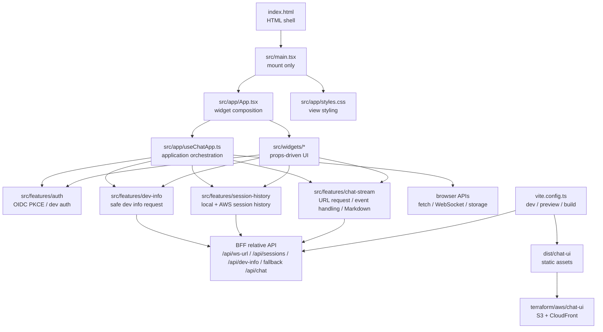
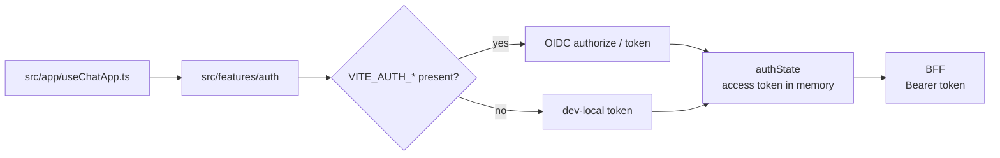
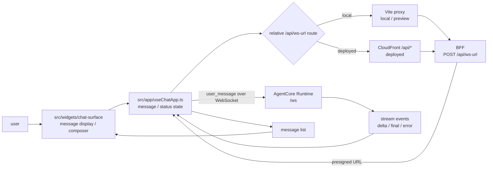

# packages/chat-ui

`packages/chat-ui` は WEL Agents PoC の browser 用 React Chat UI です。ユーザー入力、conversation ID、message list、左サイドの session history、接続状態、OIDC PKCE auth state を browser 内で管理します。通常の会話は BFF の `POST /api/ws-url` で短命 WebSocket URL を取得し、その URL で AgentCore Runtime `/ws` に直接接続して streaming 表示します。左サイドの session list は browser-local history を基準にしつつ、BFF の `GET /api/sessions` から AWS AgentCore Memory の session summary を補完します。既存の `POST /api/chat` は fallback / smoke path として BFF 側に残しますが、通常の React app は呼びません。右サイドの Environment panel は BFF の `GET /api/dev-info` を呼び、AWS / Runtime / BFF / Auth の allowlist 済み情報と browser 由来の Chat UI origin を表示します。

このディレクトリは Bun workspace `@wel-agents-poc/chat-ui` です。依存（`react` / `react-dom` / `react-markdown` / `remark-gfm` / `@fontsource-variable/material-symbols-rounded` と build 用 `vite` / `@vitejs/plugin-react` / `@types/react` / `@types/react-dom`）と `build` スクリプトは `package.json` が所有します（横断ツールと単一 `bun.lock` はルート）。

## Entry Points

| File | Role |
| --- | --- |
| `index.html` | Vite が配信する HTML shell。`#root` と `/src/main.tsx` を読み込みます。 |
| `src/main.tsx` | React app の mount 専用 entrypoint。`App` と `src/app/styles.css` を読み込みます。 |
| `src/app/App.tsx` | `useChatApp()` の状態とハンドラを props-driven widgets へ接続します。 |
| `src/app/useChatApp.ts` | chat state、WebSocket 接続、conversation ID、OIDC sign-in state、Dev Info / session refresh を束ねる application orchestration です。 |
| `src/app/styles.css` | Codex-style の3ペイン layout、desktop panel collapse button、message area、large composer、session panel、Environment rows を担います。 |
| `src/features/auth/` | OIDC Authorization Code + PKCE helper と auth state model。access token は永続化せず、callback 処理中の PKCE verifier/state だけを `sessionStorage` に置きます。 |
| `src/features/chat-stream/` | `POST /api/ws-url` request、WebSocket event parse、assistant stream state 更新、Agent message Markdown rendering 境界を扱います。 |
| `src/features/dev-info/` | `GET /api/dev-info` request と response 正規化を扱う helper。Chat UI origin / `/api` base は browser で補完します。 |
| `src/features/session-history/` | browser `localStorage` に保存する session list、message snapshot、title / preview 更新、`GET /api/sessions` response 正規化を扱います。 |
| `src/shared/ui/` | 複数 widget から使う UI primitive。Material Symbols Rounded の icon 表示を `Icon` に集約します。 |
| `src/widgets/` | `SessionRail`、`ChatSurface`、`EnvironmentPanel` の props-driven UI。application state を持ちません。 |
| `vite.config.ts` | `mise run dev:ui` / `mise run start:ui` / `bun run build:ui` の設定。env 読み込み（`envDir` + `loadEnv`）、proxy、`/ping`、build 出力先を定義します。 |

`bun run build:ui` は `packages/chat-ui/` を root にして `dist/chat-ui/` を生成します。`terraform/aws/chat-ui` はその build artifact を S3 + CloudFront で配信し、CloudFront の `/api/*` behavior で BFF origin へ routing します。

## Responsibilities

| Area | Responsibility |
| --- | --- |
| UI state | `src/app/useChatApp.ts` が `prompt`、active session の `status`、session-scoped in-flight turn、active assistant progress、`conversationId`、`sessions`、`authState` を React state として持ちます。 |
| Session persistence | active `conversationId` と session history（title、preview、message snapshot）を `localStorage` に保存します。回答中の turn は browser runtime state として session ごとに保持し、完了または失敗した assistant message だけを session history に反映します。PKCE verifier/state は callback 処理中だけ `sessionStorage` に保存し、access token は保存しません。 |
| Auth | `VITE_AUTH_*` が揃っている場合は OIDC PKCE login、未設定の場合は local dev mode として `dev-local` access token で動きます。 |
| BFF request | `POST /api/ws-url` に Bearer access token と `{ conversationId }` を送り、WebSocket URL を取得します。左サイド session list は同じ access token で `GET /api/sessions` を呼び、Environment panel は `GET /api/dev-info` を呼びます。 |
| WebSocket stream | AgentCore `/ws` へ `user_message` を送り、`ready` / `delta` / `tool_start` / `tool_end` / `final` / `error` event を parse します。message text は `delta` / `final` で更新し、`ready` / `tool_start` / `tool_end` は回答中だけ assistant progress として表示し、`error` は assistant message に表示します。 |
| Message rendering | User message は plain text として表示し、Agent message だけ `src/features/chat-stream/ui/message-markdown.tsx` で Markdown + GFM として表示します。回答中の Agent message には `src/widgets/chat-surface/AgentProgressIndicator.tsx` で一時的な進捗を表示します。raw HTML と Markdown image は描画しません。 |
| Error display | URL issuer の非 2xx response、WebSocket error、stream `error` event を assistant message として表示します。 |
| Environment display | BFF が返す safe IDs、health status、Chat UI origin / API route base を right side panel に表示します。credential、token、presigned URL、raw env は表示しません。 |
| Local serving | Vite dev / preview server が `/api/ws-url`、`/api/sessions`、`/api/dev-info`、fallback `/api/chat` を BFF へ proxy し、`GET /ping` を返します。通常 UI が呼ぶ会話 endpoint は `/api/ws-url` です。 |
| Styling | `src/app/styles.css` が Codex-style の3ペイン layout、desktop panel collapse button、message area、large composer、session panel、Environment rows を担い、system color scheme に追従する light / dark token を持ちます。 |

## Dependency Direction

依存の基本方針は、`src/main.tsx` を mount 専用、`src/app/useChatApp.ts` を application orchestration、`src/widgets/*` を props-driven display、`src/features/*` を feature ごとの API / model / UI 境界に分けることです。`app` は `features` と `widgets` を束ねます。`features` は `app` / `widgets` を import しません。`widgets` は application state を持たず、必要な型や `MessageMarkdown` だけを feature public API から参照し、複数 widget で共通の表示 primitive は `src/shared/ui/` から参照します。React app は常に相対 path の `/api/ws-url`、`/api/sessions`、`/api/dev-info` を呼びます。local dev / preview では Vite proxy が BFF へ転送し、deploy 後は CloudFront の `/api/*` behavior が BFF origin へ転送します。

## Auth Flow

`VITE_AUTH_ISSUER`、`VITE_AUTH_CLIENT_ID`、`VITE_AUTH_REDIRECT_URI`、`VITE_AUTH_SCOPE` が揃うと JWT mode になります。揃っていない場合は local dev mode になり、login UI なしで `dev-local` access token を使います。JWT mode の access token は React state にだけ保持し、browser storage には保存しません。PKCE verifier / state だけは callback 処理中に `sessionStorage` へ一時保存します。

## Chat Turn Flow

`conversationId` が空になった場合は `chat-${crypto.randomUUID()}` で再生成します。左サイドの session list は browser-local な履歴で、session ごとの title / preview / message snapshot を保持します。認証後は `GET /api/sessions` から AWS AgentCore Memory に残っている current user の session summary を取得し、未表示の conversation を空の入口として local list に merge します。event 本文はこの一覧 API では取得しません。composer は Enter で送信し、Shift+Enter で改行します。送信後は status を `busy` にし、最新の空の Agent message に考え中表示を出します。`ready` / `tool_start` / `tool_end` が届くと最新 Agent message 内の一時的な progress を更新し、`delta` / `final` が届くと本文に反映します。`final` 後は progress を消し、成功時は `ready`、失敗時は `error` にします。新規セッションでは conversation ID と message list を初期化します。

`VITE_AUTH_*` は browser bundle に入る public config なので secret を入れません。OIDC provider が Cognito の場合、`VITE_AUTH_ISSUER` は authorize / token endpoint の base URL（Hosted UI domain）で、BFF Terraform の `jwt_issuer`（User Pool issuer）とは別値になることがあります。`terraform/aws/auth` module を使う場合は `terraform -chdir=terraform/aws/auth output chat_ui_auth_env` の値を設定します。`VITE_AUTH_REDIRECT_URI` は配信 URL に合わせます。Cognito の callback は https が原則ですが、local test では `http://localhost` / `http://127.0.0.1` / `http://[::1]` も使えます。presigned WebSocket URL は一時的な認証情報を含むため、ログや共有に使わないでください。

## Configuration

env は `packages/chat-ui/.env.example` が所有します。`.env` にコピーして使い（`.env` は gitignore 済み）、`mise run dev:ui` / `mise run start:ui` は packages/chat-ui に cd して Vite を起動します。`vite.config.ts` は `envDir` を packages/chat-ui（root）に設定し、config-time 値（proxy target / host / port）を `loadEnv(mode, root, "")` で読み取ります。空 prefix なので shell-export した変数が `.env` 値を上書きします。`VITE_*` は browser bundle に入る public config として `import.meta.env` から参照され、それ以外は config-time 専用です。secret は入れません。

## File Map

| File | Summary |
| --- | --- |
| `index.html` | Vite 用 HTML shell。favicon と `/src/main.tsx` を読み込みます。 |
| `src/main.tsx` | React root mount 専用 entrypoint。`App` と `src/app/styles.css` を読み込みます。 |
| `src/app/App.tsx` | `useChatApp()` の戻り値を `SessionRail`、`ChatSurface`、`EnvironmentPanel` へ配線します。 |
| `src/app/useChatApp.ts` | auth state、session list、form submit、URL issuer request、WebSocket event 反映、message / status state を担います。 |
| `src/app/styles.css` | 画面全体の3ペイン layout、chat surface、Environment panel、message、composer、responsive styling を定義します。 |
| `src/features/auth/api/oauth.ts` | OIDC PKCE authorization URL 生成と authorization code exchange を担います。 |
| `src/features/auth/model/auth-state.ts` | public auth env の読み取り、JWT / local dev auth state、authenticated state 生成を担います。 |
| `src/features/auth/auth.test.ts` | PKCE URL / token exchange / public auth env の contract を検証します。 |
| `src/features/chat-stream/api/websocket-url.ts` | `/api/ws-url` request と error handling を担います。 |
| `src/features/chat-stream/model/agent-events.ts` | AgentCore stream event parse、assistant stream text、回答中の ephemeral progress state 更新を担います。 |
| `src/features/chat-stream/ui/message-markdown.tsx` | Agent message の Markdown + GFM rendering、link attribute、Markdown image 非表示を担います。 |
| `src/features/chat-stream/chat-stream.test.ts` | URL issuer request と stream event 反映、回答中 progress state の contract を検証します。 |
| `src/features/chat-stream/ui/message-markdown.test.tsx` | Markdown semantic output、GFM、raw HTML 非 DOM 化、link attribute、image 非表示を検証します。 |
| `src/features/dev-info/api/dev-info.ts` | `/api/dev-info` request、allowlist response 正規化、Chat UI origin / API route base の補完を担います。 |
| `src/features/dev-info/api/dev-info.test.ts` | Dev Info request、Bearer token、error handling、unknown / not_configured fallback、余分な secret-like key を落とす contract を検証します。 |
| `src/features/session-history/model/session-history.ts` | browser-local session list、message snapshot、title / preview 更新、localStorage persistence を担います。 |
| `src/features/session-history/model/session-history.test.ts` | session history の保存・読み込み・並び替え・message 由来 metadata 更新・AWS summary merge を検証します。 |
| `src/features/session-history/api/sessions-api.ts` | `/api/sessions` request、AWS session summary response の正規化、error handling を担います。 |
| `src/features/session-history/api/sessions-api.test.ts` | `/api/sessions` request、Bearer token、response 正規化、error handling を検証します。 |
| `src/shared/ui/Icon.tsx` | Material Symbols Rounded の decorative icon wrapper。`aria-hidden`、font variation、size、class を一箇所で扱います。 |
| `src/shared/ui/Icon.test.tsx` | `Icon` の static rendering contract を検証します。 |
| `src/widgets/session-rail/SessionRail.tsx` | 左サイドの session list、refresh、新規作成、desktop collapse button、mobile overlay 表示を担います。 |
| `src/widgets/chat-surface/ChatSurface.tsx` | topbar、message thread、回答中 progress、composer、送信ボタン、mobile panel action を担います。 |
| `src/widgets/chat-surface/AgentProgressIndicator.tsx` | 最新 Agent message 内に、回答中だけ表示する compact progress indicator を定義します。 |
| `src/widgets/chat-surface/AgentProgressIndicator.test.tsx` | progress indicator の status role、ARIA、tone 属性の描画 contract を検証します。 |
| `src/widgets/environment-panel/EnvironmentPanel.tsx` | auth / conversation / Dev Info / connection 状態の右サイド panel と desktop collapse button を担います。 |
| `vite.config.ts` | React plugin、`/api/ws-url` / `/api/sessions` / `/api/dev-info` / `/api/chat` proxy、`/ping` middleware、`dist/chat-ui` build 出力を定義します。 |
| `vite.config.test.ts` | env 解決、proxy、build outDir など Vite config の contract を検証します。 |
| `public/favicon.svg` | Vite public asset。build 時は static asset として出力されます。 |

## Change Guide

- Chat UI が BFF に送る WebSocket URL issuer contract を変える場合は `src/features/chat-stream/api/websocket-url.ts` と `packages/bff/application/handle-ws-url-request.ts` を合わせます。
- AWS session list の contract を変える場合は `src/features/session-history/api/sessions-api.ts`、`src/features/session-history/model/session-history.ts`、`src/app/useChatApp.ts` と `packages/bff/application/handle-sessions-request.ts` を合わせます。
- OIDC / PKCE の public config、callback 処理、sign-in / sign-out state を変える場合は `src/features/auth/` と `src/app/useChatApp.ts` を合わせます。
- 左サイドの session list、browser-local 履歴、message snapshot の保存方針を変える場合は `src/features/session-history/model/session-history.ts`、`src/app/useChatApp.ts`、`src/widgets/session-rail/SessionRail.tsx` を合わせます。
- Environment panel の表示項目や fallback 表示を変える場合は `src/features/dev-info/api/dev-info.ts`、`src/app/useChatApp.ts`、`src/widgets/environment-panel/EnvironmentPanel.tsx`、`src/app/styles.css` と `packages/bff/contracts/dev-info.ts` を合わせます。
- Agent message の Markdown 表示、raw HTML / image policy、link attribute を変える場合は `src/features/chat-stream/ui/message-markdown.tsx`、`src/features/chat-stream/ui/message-markdown.test.tsx`、`src/widgets/chat-surface/ChatSurface.tsx`、`src/app/styles.css` を合わせます。
- AgentCore からの stream event 表示を変える場合は `src/features/chat-stream/model/agent-events.ts` の `parseAgentEvent()` / `applyAgentEvent()` と `src/app/useChatApp.ts` を見ます。
- local dev / preview の BFF 接続先、host、port、`/ping` を変える場合は `vite.config.ts` を見ます。
- 画面 layout や responsive styling を変える場合は `src/app/styles.css` を見ます。
- deploy 後の `/api/*` routing を変える場合は `terraform/aws/chat-ui` の CloudFront 設定を見ます。
- fallback `/api/chat` を削除する場合は `vite.config.ts` の proxy、`packages/bff`、`terraform/aws/bff`、`terraform/aws/chat-ui` の docs / routing を合わせます。
