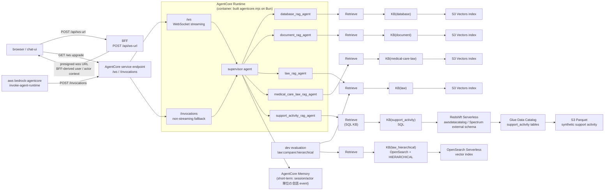

# agentcore

Amazon Bedrock AgentCore Runtime 上に、**supervisor + 複数の専門 RAG agent** の TypeScript runtime を構築する Terraform module。4つの既存専門 agent はそれぞれ独立した Bedrock vector Knowledge Base（vector store は **S3 Vectors**）を検索し、追加の `support_activity` agent は Bedrock **SQL Knowledge Base** から Redshift Spectrum / Glue Data Catalog backed by S3 Parquet を検索する。比較用に、同じ `law/` corpus を OpenSearch Serverless + `HIERARCHICAL` chunking へ取り込む `law_hierarchical` Knowledge Base も作成するが、通常の `law_rag_agent` は引き続き S3 Vectors 版の `LAW_KB_ID` を使う。supervisor が質問を分類・委譲・統合し、会話履歴は **AgentCore Memory**（short-term）で session / actor 単位に保持する。

アプリ本体はこのリポジトリの [`packages/`](../../../packages)（Bun + TypeScript + Strands Agents）で、[`Dockerfile.agentcore`](../../../Dockerfile.agentcore) の builder stage が `packages/agentcore/index.ts` を `dist/agentcore/agentcore.mjs` に bundle し、runtime image には build 済み artifact だけをコピーする。そのイメージを **ECR** へ push し、AgentCore Runtime が container artifact として起動する（Python の direct code ZIP は使わない）。BFF が発行する AgentCore WebSocket URL には BFF-derived user / actor context を含めるため、この module は `X-Amzn-Bedrock-AgentCore-Runtime-Custom-ActorId` と `X-Amzn-Bedrock-AgentCore-Runtime-Custom-UserId` を Runtime の request header allowlist に登録する。通常の Chat UI は BFF の `POST /api/ws-url` で短命 presigned WebSocket URL を取得し、その URL で AgentCore Runtime `/ws` へ接続する。`POST /invocations` は non-streaming smoke / fallback path として残す。

> [WARNING] **AgentCore Runtime・Bedrock model invocation・Knowledge Base・S3 Vectors・OpenSearch Serverless・Redshift Serverless / Spectrum・Glue Data Catalog・Lake Formation・S3・Memory・ECR は利用量に応じて課金される可能性がある。** 使用しない場合は [`cleanup.md`](./cleanup.md) に従って削除する。

## 構成図（概念）



## 前提

- `mise run bs` または `mise install` 済み（`terraform` / `aws-cli` は mise が `mise.toml` で固定）。
- AWS provider が使える認証情報と region（`AWS_PROFILE` / `AWS_REGION` など）。
- generation model と embedding model 両方への Bedrock model access が、その region で有効。
- 対象 region で **S3 Vectors + OpenSearch Serverless + Bedrock Knowledge Base + Bedrock structured data store KB + Redshift Serverless + Glue Data Catalog + Lake Formation** が利用可能（未対応 region では apply が失敗する）。
- Lake Formation の S3 prefix registration と database `DESCRIBE` grant は sample prefix / sample Glue database に限定して管理する。`DATA_LOCATION_ACCESS` と table `SELECT` / `DESCRIBE` の明示 grant は既定では作成しない。厳格な Lake Formation 管理を検証する場合だけ `enable_lakeformation_data_grants = true` にし、Terraform 実行 principal に Lake Formation data lake admin または対象 data location / table の grant 権限を付与する。既存 account-wide data lake settings はこの module では変更しない。
- コンテナイメージを build / push できる Docker（または Finch / Podman）。

## 手順

すべてリポジトリルートから実行する（`-chdir` で root module を指す）。

### 1. ECR repository を先に作成（イメージ push 先）

AgentCore Runtime は作成時にイメージの存在を要求するため、まず ECR repository だけを作る。

```bash
cp terraform/aws/agentcore/terraform.tfvars.template \
   terraform/aws/agentcore/terraform.tfvars
# terraform.tfvars を編集し model_id を設定

mise exec -- terraform -chdir=terraform/aws/agentcore init
# data source も -target に含める。含めないと build_push_commands output が state に書かれず、
# 手順 2 の `terraform output build_push_commands` が "Output not found" になる。
mise exec -- terraform -chdir=terraform/aws/agentcore apply \
  -target=aws_ecr_repository.this \
  -target=data.aws_caller_identity.current \
  -target=data.aws_region.current
```

### 2. コンテナイメージを build して push

`build_push_commands` output に手順が出る。ARM64 で build すること。

```bash
mise exec -- terraform -chdir=terraform/aws/agentcore output build_push_commands
# 出力された 3 コマンド（ECR login → docker build --platform linux/arm64 -f Dockerfile.agentcore → docker push）を実行
```

### 3. 残りを apply

```bash
mise exec -- terraform -chdir=terraform/aws/agentcore fmt -check
mise exec -- terraform -chdir=terraform/aws/agentcore validate
mise exec -- terraform -chdir=terraform/aws/agentcore plan
mise exec -- terraform -chdir=terraform/aws/agentcore apply
```

> `agent_image_uri` を tfvars に明示すれば、本 module の ECR ではなく任意のレジストリのイメージを使える（その場合 step 1-2 は外部での push に置き換わる）。

### 4. Knowledge Base を取り込む（ingestion / sync）

apply は vector KB・data source・S3 への文書 upload と、support_activity SQL KB / `REDSHIFT_METADATA` data source / Glue / Redshift Spectrum external schema の作成までを行う。**KB ingestion / sync は Terraform 管理外**なので、apply 後（および文書・schema 変更時）に ingestion job を起動する。`mise run aws:apply:agentcore` / `mise run aws:apply` は S3 Vectors 版 vector KB、OpenSearch Serverless 版 `law_hierarchical` KB、support_activity SQL KB の metadata ingestion を起動する。

```bash
mise exec -- terraform -chdir=terraform/aws/agentcore output start_ingestion_commands
# 出力された aws bedrock-agent start-ingestion-job ... を順に実行
```

ingestion が `COMPLETE` になるまで、その KB を引く専門 agent は文書を見つけられない。

support_activity SQL KB の metadata ingestion が `COMPLETE` になった後、直接確認する場合は次を使う。

```bash
mise exec -- terraform -chdir=terraform/aws/agentcore output -raw support_activity_retrieve_command
```

`law_hierarchical` ingestion が `COMPLETE` になった後、現行 `law` KB と Hierarchical 版を同一 query で比較する場合は、`LAW_KB_ID` と `LAW_HIERARCHICAL_KB_ID` を設定して次を実行する。

```bash
bun run law:compare:hierarchical --query "児童虐待の通告義務はどの条文ですか？"
```

### 5. Smoke test

```bash
mise exec -- terraform -chdir=terraform/aws/agentcore output -raw invoke_command
# 出力された mkdir -p tmp && mise exec -- aws bedrock-agentcore invoke-agent-runtime ... を実行し tmp/response.json を確認
```

この `invoke_command` は `POST /invocations` の non-streaming smoke test 用。Chat UI の本線である WebSocket streaming は、`terraform/aws/bff` が `POST /api/ws-url` で発行する presigned `/ws` URL から接続して確認する。この module は runtime / endpoint / request header allowlist を管理し、browser 向けの URL 署名と JWT user context 導出は BFF module が担う。

## このモジュールが作るリソース

- `aws_ecr_repository.this`（runtime コンテナイメージ）
- `aws_s3_bucket.data` / `aws_s3_bucket_public_access_block.data` / `aws_s3_object.data`（vector KB 用サンプル文書 + 児童虐待防止法 corpus + 保険診療基本法令テキストブック OCR corpus + support_activity synthetic CSV / Parquet）
- `aws_s3vectors_vector_bucket.this` / `aws_s3vectors_index.this`（4 つ）
- `aws_bedrockagent_knowledge_base.this`（vector KB 4 つ）/ `aws_bedrockagent_data_source.this`（4 つ）
- `aws_opensearchserverless_collection.law_hierarchical` / `opensearch_index.law_hierarchical` / `aws_bedrockagent_knowledge_base.law_hierarchical` / `aws_bedrockagent_data_source.law_hierarchical`（law corpus の Hierarchical chunking 比較用）
- `aws_bedrockagent_knowledge_base.support_activity` / `aws_bedrockagent_data_source.support_activity_metadata`（support_activity SQL Knowledge Base と SQL 生成用 metadata data source）
- `aws_redshiftserverless_namespace.support_activity` / `aws_redshiftserverless_workgroup.support_activity` / `aws_redshiftdata_statement.support_activity_external_schema` / `aws_redshiftdata_statement.support_activity_kb_*`
- `aws_glue_catalog_database.support_activity` / `aws_glue_catalog_table.support_activity`（4 tables）
- `aws_lakeformation_resource.support_activity_parquet` / `aws_lakeformation_permissions.support_activity_database`（`DATA_LOCATION_ACCESS` と table grants は `enable_lakeformation_data_grants = true` の場合のみ）
- `aws_bedrockagentcore_memory.this`
- `aws_bedrockagentcore_agent_runtime.this`（`/ws` と `/invocations` を公開する container runtime。BFF-derived custom user / actor header allowlist を含む）/ `aws_bedrockagentcore_agent_runtime_endpoint.sample`
- `aws_iam_role.runtime` / `aws_iam_role_policy.runtime`（実行用：ECR pull / logs / model invoke / `bedrock:Retrieve` / optional `bedrock:GenerateQuery` / Memory）
- `aws_iam_role.kb_service` / `aws_iam_role_policy.kb_service`（KB service 用：embedding invoke / S3 data 読み取り / S3 Vectors 読み書き / law_hierarchical OpenSearch Serverless API access）
- `aws_iam_role.support_activity_kb_service` / `aws_iam_role_policy.support_activity_kb_service`（SQL KB service 用：Redshift Data API / Glue / Lake Formation / S3 Parquet / GenerateQuery / SQL generation context）
- `aws_iam_role.redshift_spectrum` / `aws_iam_role_policy.redshift_spectrum`（Redshift Spectrum 用：Glue / Lake Formation / S3 Parquet）

検索（query）時の S3 Vectors アクセスは KB が KB service role で代行するため、runtime 実行ロールには S3 Vectors 権限を付けていない。`bedrock_model_resource_arns` の default `["*"]` は PoC 向けで、production では generation model の ARN に絞り込む。

## 更新

デプロイ済みの資産（エージェントコード / ナレッジ文書 / 設定）を更新したときの手順は [`update.md`](./update.md) を参照する。

## cleanup

学習後は [`cleanup.md`](./cleanup.md) の手順で削除する。
