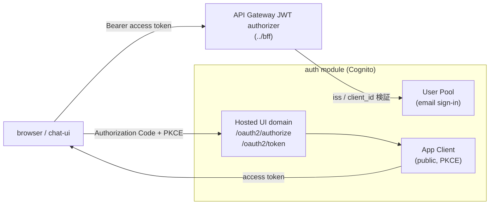

# Auth (Amazon Cognito)

Chat UI / BFF を保護する **OIDC provider** を Amazon Cognito User Pool で作成する Terraform module。ブラウザ SPA（chat-ui）用の **public App Client**（Authorization Code + PKCE）と **Hosted UI domain** を作り、BFF（API Gateway HTTP API JWT authorizer）が検証する `jwt_issuer` / `jwt_audience` を output で提供する。

この module は IdP だけを管理する。BFF 本体は [`../bff`](../bff)、静的 UI 配信は [`../chat-ui`](../chat-ui)、AgentCore Runtime 本体は [`../agentcore`](../agentcore) が管理する。

> [WARNING] **Cognito User Pool / App Client / Hosted UI は利用量に応じて課金される可能性がある**（MAU 無料枠あり）。使用しない場合は [`cleanup.md`](./cleanup.md) に従って削除する。

## 設計のポイント

- **email サインイン**（`username_attributes = ["email"]`）。組織内 PoC のため **self sign-up は無効**で、管理者がユーザーを作成する（`admin_create_user_config.allow_admin_create_user_only = true`）。
- **public App Client**（`generate_secret = false`）。`code` grant のみ許可し、ブラウザでは PKCE を使う。client secret はブラウザに置けないため作らない。
- chat-ui は取得した **access token** を BFF に Bearer 送信する。Cognito access token は `aud` を持たず `client_id` を持つため、API Gateway JWT authorizer は **`jwt_audience` を access token の `client_id` と照合**する。したがって `jwt_audience` には **App Client ID** を指定する（output `jwt_audience` が提供する）。
- `jwt_issuer` は User Pool issuer = `https://cognito-idp.<region>.amazonaws.com/<userPoolId>`（token の `iss`）。これは chat-ui の `VITE_AUTH_ISSUER`（Hosted UI domain）とは**別の値**である点に注意する。

## 構成図（概念）



## 前提

- `mise run bs` または `mise install` 済み（`terraform` / `aws-cli` は mise が `mise.toml` で固定）。
- AWS provider が使える認証情報と region（`AWS_PROFILE` / `AWS_REGION` など）。

## 手順

すべてリポジトリルートから実行する（`-chdir` で root module を指す）。

### 1. tfvars を作成

```bash
cp terraform/aws/auth/terraform.tfvars.template \
   terraform/aws/auth/terraform.tfvars
```

`callback_urls` / `logout_urls` に、local dev の chat-ui（`http://localhost:4173/`）と、デプロイ済み chat-ui の CloudFront URL を設定する。Cognito は **https が原則**だが、local test 用に `http://localhost` / `http://127.0.0.1` / `http://[::1]` は許可される。`terraform.tfvars` は環境固有値を含むためコミットしない。

初回で CloudFront URL がまだ分からない場合は、local dev URL だけでこの module を先に apply する。`terraform/aws/chat-ui` の初回 apply で `site_url` を取得した後、`callback_urls` / `logout_urls` にその URL を追加してこの module を再 apply する。

### 2. plan / apply

```bash
mise exec -- terraform -chdir=terraform/aws/auth init
mise exec -- terraform -chdir=terraform/aws/auth fmt -check
mise exec -- terraform -chdir=terraform/aws/auth validate
mise exec -- terraform -chdir=terraform/aws/auth plan
mise exec -- terraform -chdir=terraform/aws/auth apply
```

### 3. ユーザーを作成（self sign-up 無効のため管理者が作成）

```bash
USER_POOL_ID="$(mise exec -- terraform -chdir=terraform/aws/auth output -raw user_pool_id)"

# ユーザー作成（仮パスワードはメール通知される）
mise exec -- aws cognito-idp admin-create-user \
  --user-pool-id "${USER_POOL_ID}" \
  --username "user@example.com" \
  --user-attributes Name=email,Value="user@example.com" Name=email_verified,Value=true

# 仮パスワードを恒久パスワードに変更（任意。Hosted UI 初回ログインでも変更可）
mise exec -- aws cognito-idp admin-set-user-password \
  --user-pool-id "${USER_POOL_ID}" \
  --username "user@example.com" \
  --password '<恒久パスワード>' \
  --permanent \
  --region ap-northeast-1 \
  --no-cli-pager
```

### 4. BFF / chat-ui に値を配線

```bash
# BFF（terraform/aws/bff/terraform.tfvars に転記）
mise exec -- terraform -chdir=terraform/aws/auth output bff_jwt_config

# chat-ui（build 時の VITE_AUTH_* 環境変数）。VITE_AUTH_REDIRECT_URI は配信 URL に合わせて設定する。
mise exec -- terraform -chdir=terraform/aws/auth output chat_ui_auth_env
```

## このモジュールが作るリソース

- `aws_cognito_user_pool.this`
- `aws_cognito_user_pool_domain.this`
- `aws_cognito_user_pool_client.web`

## output

| output | 用途 |
| --- | --- |
| `jwt_issuer` | BFF `terraform.tfvars` の `jwt_issuer`。 |
| `jwt_audience` | BFF `terraform.tfvars` の `jwt_audience`（= App Client ID）。 |
| `bff_jwt_config` | 上記 2 つをまとめた map。BFF tfvars への転記用。 |
| `chat_ui_auth_env` | chat-ui build 時の `VITE_AUTH_ISSUER` / `VITE_AUTH_CLIENT_ID` / `VITE_AUTH_SCOPE`。 |
| `hosted_ui_base_url` | Hosted UI / OAuth2 endpoint の base URL（= `VITE_AUTH_ISSUER`）。 |
| `user_pool_id` / `app_client_id` / `user_pool_arn` | CLI 操作・参照用。 |

## 更新

設定（callback URL / scope / token validity など）を更新したときの手順は [`update.md`](./update.md) を参照する。

## cleanup

学習後は [`cleanup.md`](./cleanup.md) の手順で削除する。
