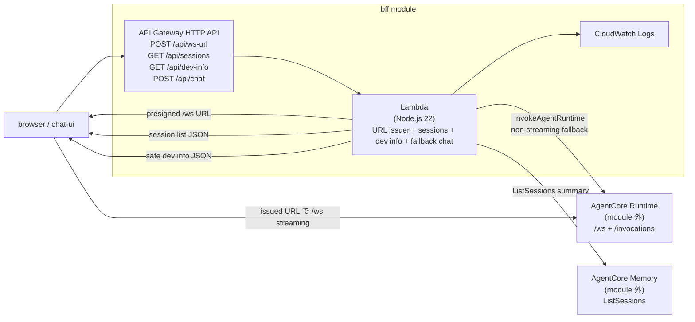

# AgentCore BFF

静的 HTML チャット UI から呼び出す **BFF（Backend for Frontend）** を作成する Terraform module。API Gateway HTTP API が JWT authorizer で `POST /api/ws-url` / `GET /api/sessions` / `GET /api/dev-info` / `POST /api/chat` を保護する。通常の Chat UI は `POST /api/ws-url` で BFF を必ず通り、BFF が発行した短命 AgentCore WebSocket URL で AgentCore Runtime `/ws` に streaming 接続する。`GET /api/sessions` は認証済み user に対応する actor の AgentCore Memory session summary を `ListSessions` で取得し、Chat UI の左ペイン用に browser `conversationId` だけへ戻して返す。既存の `POST /api/chat` は non-streaming fallback / smoke check 用で、Lambda が Amazon Bedrock AgentCore Runtime の `InvokeAgentRuntime` を SigV4 署名付き HTTPS request で呼び出す。`GET /api/dev-info` は開発補助用で、allowlist 済みの AWS / Runtime / BFF / Auth 識別子だけを返す。

この module は BFF だけを管理する。静的 UI 配信は [`../chat-ui`](../chat-ui)、AgentCore Runtime 本体は [`../agentcore`](../agentcore) が管理する。

> [WARNING] `GET /ping` は health check 用に public のままにする。`POST /api/ws-url`、`GET /api/sessions`、`GET /api/dev-info`、`POST /api/chat` は `jwt_issuer` / `jwt_audience` で設定した JWT authorizer によって保護する。

> [WARNING] **API Gateway・Lambda・CloudWatch Logs・AgentCore Runtime invoke は利用量に応じて課金される可能性がある。** 使用しない場合は [`cleanup.md`](./cleanup.md) に従って削除する。

## 構成図（概念）



## 前提

- `mise run bs` または `mise install` 済み（`terraform` / `aws-cli` は mise が `mise.toml` で固定）。
- `bun run build:bff` で `packages/bff/lambda.ts` から Lambda artifact を生成済み。
- AWS provider が使える認証情報と region（`AWS_PROFILE` / `AWS_REGION` など）。
- `agent_runtime_arn` に指定する AgentCore Runtime が作成済み。
- AgentCore Runtime 側には `sample` endpoint（または `agent_runtime_qualifier` に指定する endpoint）が存在する。
- `jwt_issuer` / `jwt_audience` に指定する OIDC provider と client が作成済み（[`../auth`](../auth) module で Cognito User Pool + App Client を作成し、output `bff_jwt_config` を転記できる）。
- `/api/ws-url` で使う access token に、`bff_user_id_claim` / `bff_actor_claim` で指定する claim（default はどちらも `sub`）が含まれている。

## 手順

すべてリポジトリルートから実行する（`-chdir` で root module を指す）。

### 1. AgentCore Runtime ARN を確認

`agentcore` module で作った runtime を使う場合:

```bash
mise exec -- terraform -chdir=terraform/aws/agentcore output -raw agent_runtime_arn
```

### 2. tfvars を作成

```bash
cp terraform/aws/bff/terraform.tfvars.template \
   terraform/aws/bff/terraform.tfvars
```

`terraform.tfvars` の `agent_runtime_arn`、`jwt_issuer`、`jwt_audience` を設定する。`bff_user_id_claim` / `bff_actor_claim` は `/api/ws-url` が JWT claims から AgentCore user / actor context を導出するための claim 名、`ws_url_expires_seconds` は BFF が発行する presigned WebSocket URL の有効秒数（30-300秒）を表す。`default_actor_id` は fallback `/api/chat` の Runtime payload で使う。Dev Info panel が表示する KB / Memory ID（`dev_info_database_kb_id`、`dev_info_document_kb_id`、`dev_info_law_kb_id`、`dev_info_medical_care_law_kb_id`、`dev_info_support_activity_kb_id`、`dev_info_agentcore_memory_id`）は、`mise run aws:apply` / `aws:apply:bff` が `terraform/aws/agentcore` の `knowledge_base_ids` / `memory_id` output から自動注入する（`agent_runtime_arn` / `jwt_*` と同じ仕組み）ので通常は設定不要。単体 `terraform apply` で適用する場合や値を上書きしたい場合のみ `terraform.tfvars` に記入する。`dev_info_auth_client_id` は空なら `jwt_audience[0]` を表示する。Lambda はこれらに加えて `DEV_INFO_JWT_ISSUER` と `DEV_INFO_LAMBDA_LOG_GROUP_NAME` を環境変数として受け取る。`terraform.tfvars` は環境固有値を含むためコミットしない。

### 3. plan / apply

```bash
bun run build:bff
mise exec -- terraform -chdir=terraform/aws/bff init
mise exec -- terraform -chdir=terraform/aws/bff fmt -check
mise exec -- terraform -chdir=terraform/aws/bff validate
mise exec -- terraform -chdir=terraform/aws/bff plan
mise exec -- terraform -chdir=terraform/aws/bff apply
```

### 4. BFF を単体で確認

```bash
curl -s "$(mise exec -- terraform -chdir=terraform/aws/bff output -raw ping_endpoint)"

BFF_ENDPOINT="$(mise exec -- terraform -chdir=terraform/aws/bff output -raw api_endpoint)"
curl -s "${BFF_ENDPOINT}/api/ws-url" \
  -H "authorization: Bearer <access_token>" \
  -H "content-type: application/json" \
  -d '{"conversationId":"chat-00000000-0000-4000-8000-000000000000"}' \
  | sed -E 's#"webSocketUrl":"[^"]+"#"webSocketUrl":"<redacted>"#'

curl -s "${BFF_ENDPOINT}/api/sessions" \
  -H "authorization: Bearer <access_token>"

curl -s "${BFF_ENDPOINT}/api/dev-info" \
  -H "authorization: Bearer <access_token>"

curl -s "$(mise exec -- terraform -chdir=terraform/aws/bff output -raw chat_endpoint)" \
  -H "authorization: Bearer <access_token>" \
  -H "content-type: application/json" \
  -d '{"message":"Amazon S3 とは何ですか？","conversationId":"chat-00000000-0000-4000-8000-000000000000"}'
```

`POST /api/ws-url` は Chat UI から使う短命 URL issuer。presigned URL は一時的な認証情報を含むため、debug log やチケットに貼らない。`GET /api/sessions` は Chat UI 左ペインの AWS session 一覧。`GET /api/dev-info` は Chat UI side panel の開発補助情報。`POST /api/chat` は streaming ではない fallback / smoke check 用。

## API contract

`POST /api/ws-url`

Request:

```json
{
  "conversationId": "chat-00000000-0000-4000-8000-000000000000"
}
```

Header:

```text
Authorization: Bearer <access_token>
```

Response:

```json
{
  "conversationId": "chat-00000000-0000-4000-8000-000000000000",
  "expiresIn": 300,
  "webSocketUrl": "wss://bedrock-agentcore.ap-northeast-1.amazonaws.com/runtimes/..."
}
```

この access token は API Gateway JWT authorizer が issuer / audience / scope で検証する。BFF は authorizer が検証した claims から user / actor context を導出し、AgentCore WebSocket URL に BFF-derived runtime session / actor / user context を含める。browser は `conversationId` だけを渡し、AgentCore Runtime session ID、actor ID、user ID は直接指定しない。

`POST /api/chat`

non-streaming fallback / smoke check 用。通常の Chat UI はこの endpoint ではなく `/api/ws-url` から取得した WebSocket URL で AgentCore Runtime `/ws` に接続する。

Header:

```text
Authorization: Bearer <access_token>
```

Request:

```json
{
  "message": "質問本文",
  "conversationId": "chat-00000000-0000-4000-8000-000000000000"
}
```

Response:

```json
{
  "conversationId": "chat-00000000-0000-4000-8000-000000000000",
  "response": "AgentCore Runtime からの応答本文"
}
```

この fallback では、`conversationId` を AgentCore Runtime の runtime session ID と runtime payload の `session_id` の両方に使う。API 仕様に合わせ、33-256文字かつ英数字始まりの `[A-Za-z0-9_-]` だけを許可する。`actor_id` は browser からは受け取らず、Lambda 環境変数 `DEFAULT_ACTOR_ID` の値を使う。

Lambda から AgentCore Runtime へ渡す payload:

```json
{
  "prompt": "質問本文",
  "session_id": "chat-00000000-0000-4000-8000-000000000000",
  "actor_id": "web-user"
}
```

`GET /api/sessions`

Chat UI 左ペイン用の session list endpoint。API Gateway JWT authorizer で保護し、BFF は authorizer が検証した claims から actor / user context を導出する。BFF はその actor だけを対象に AgentCore Memory `ListSessions` を呼び、BFF が付けた user-scoped runtime session ID prefix を外して browser `conversationId` に戻す。session event 本文は取得しない。

Header:

```text
Authorization: Bearer <access_token>
```

Response:

```json
{
  "memoryId": "memory-id",
  "sessions": [
    {
      "conversationId": "chat-00000000-0000-4000-8000-000000000000",
      "createdAt": "2026-06-17T02:00:00.000Z"
    }
  ],
  "truncated": false
}
```

`dev_info_agentcore_memory_id` が空の場合は `503` を返す。Lambda IAM はこの Memory ARN に対する `bedrock-agentcore:ListSessions` だけを許可する。

`GET /api/dev-info`

Chat UI side panel 用の開発補助 endpoint。API Gateway JWT authorizer で保護し、BFF は認証済み context
がない request を `401` にする。

Header:

```text
Authorization: Bearer <access_token>
```

Response は account ID、region、Runtime ARN / qualifier / endpoint、5つの Knowledge Base ID、AgentCore Memory ID、BFF endpoint、Lambda function / log group、JWT issuer / client ID、health status だけを allowlist する。credential、token、presigned URL、raw Terraform state、raw env は返さない。
production Runtime health は安全な probe を追加するまで `not_checked` として返す。

## このモジュールが作るリソース

- `aws_apigatewayv2_api.this`
- `aws_apigatewayv2_authorizer.jwt`
- `aws_apigatewayv2_integration.lambda`
- `aws_apigatewayv2_route.chat`
- `aws_apigatewayv2_route.dev_info`
- `aws_apigatewayv2_route.sessions`
- `aws_apigatewayv2_route.ws_url`
- `aws_apigatewayv2_route.ping`
- `aws_apigatewayv2_stage.default`
- `aws_lambda_function.this`
- `aws_lambda_permission.api_gateway`
- `aws_cloudwatch_log_group.lambda`
- `aws_cloudwatch_log_group.api`
- `aws_iam_role.lambda`
- `aws_iam_role_policy.lambda`

Lambda deployment package は `bun run build:bff` で `packages/bff/lambda.ts` から `dist/bff-lambda/index.mjs` に bundle し、`archive_file` data source でその build artifact から作成する。同じ build で local BFF server 用の `dist/bff-dev-server/index.mjs` も生成する。`dist/` は生成物なのでコミットしない。

## 更新

デプロイ済みの Lambda handler / BFF 設定 / 接続先 AgentCore Runtime を更新したときの手順は [`update.md`](./update.md) を参照する。

## cleanup

学習後は [`cleanup.md`](./cleanup.md) の手順で削除する。
