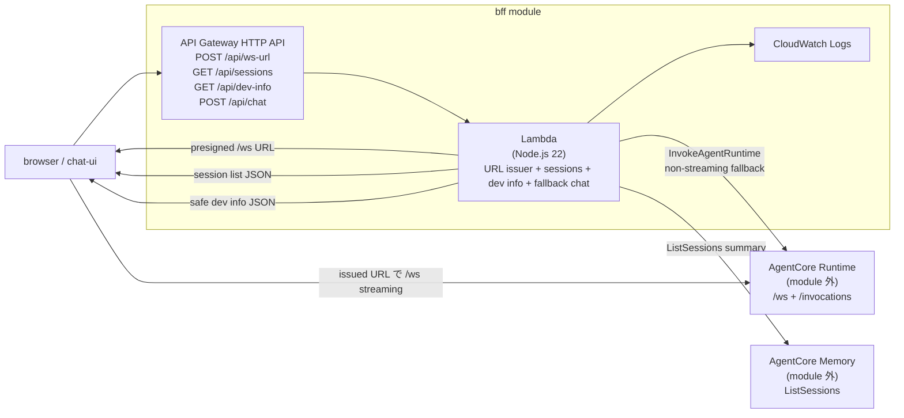
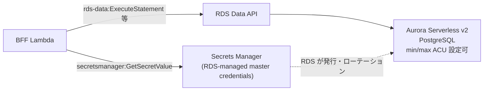

# AgentCore BFF

静的 HTML チャット UI から呼び出す **BFF（Backend for Frontend）** を作成する Terraform module。API Gateway HTTP API が JWT authorizer で `POST /api/ws-url` / `GET /api/sessions` / `GET /api/dev-info` / `POST /api/chat` を保護する。通常の Chat UI は `POST /api/ws-url` で BFF を必ず通り、BFF が発行した短命 AgentCore WebSocket URL で AgentCore Runtime `/ws` に streaming 接続する。`GET /api/sessions` は認証済み user に対応する actor の AgentCore Memory session summary を `ListSessions` で取得し、Chat UI の左ペイン用に browser `conversationId` だけへ戻して返す。既存の `POST /api/chat` は non-streaming fallback / smoke check 用で、Lambda が Amazon Bedrock AgentCore Runtime の `InvokeAgentRuntime` を SigV4 署名付き HTTPS request で呼び出す。`GET /api/dev-info` は開発補助用で、allowlist 済みの AWS / Runtime / BFF / Auth 識別子だけを返す。

Workbench 向けの追加 endpoint として、`POST /api/soap-draft`（SOAP Studio「SOAP 下書き生成」、issue #5、AgentCore Runtime の `soap_draft` 単発分類 agent を呼ぶ）と `POST /api/voice-recordings` + `GET /api/voice-recordings/{recordingId}` + `PATCH /api/voice-recordings/{recordingId}`（Voice Capture、issue #7）も同じ JWT authorizer で保護する。Voice Capture の 3 endpoint は AgentCore Runtime を経由せず、この module が作る S3 bucket（`aws_s3_bucket.voice_capture`）と Amazon Transcribe の非同期文字起こし job を Lambda が直接呼び出す（`recordingId` が S3 key prefix と Transcribe job name を兼ねるため、状態管理用の DB は持たない）。

> [!IMPORTANT]
> Amazon Transcribe の既定の認可方式（Forward Access Sessions。呼び出し元 IAM principal の権限をそのまま使う）だけでは、アカウントによって `StartTranscriptionJob` が `BadRequestException: The specified S3 bucket can't be accessed` になることが実機検証で確認されている（呼び出し元の IAM principal 自身は直接 S3 を読み書きできるのに、Transcribe 経由だと失敗する）。そのため、この module は `aws_iam_role.voice_capture_transcribe`（`transcribe.amazonaws.com` が assume する専用 role）を作り、`StartTranscriptionJob` の `JobExecutionSettings.DataAccessRoleArn` に明示的に渡す。`VOICE_CAPTURE_TRANSCRIBE_ROLE_ARN` が未設定の場合は Forward Access Sessions にフォールバックするので、Forward Access Sessions が機能するアカウントでは無くても動く。

この module は BFF だけを管理する。静的 UI 配信は [`../chat-ui`](../chat-ui)、AgentCore Runtime 本体は [`../agentcore`](../agentcore) が管理する。

> [WARNING] `GET /ping` は health check 用に public のままにする。`POST /api/ws-url`、`GET /api/sessions`、`GET /api/dev-info`、`POST /api/chat` は `jwt_issuer` / `jwt_audience` で設定した JWT authorizer によって保護する。

> [WARNING] **API Gateway・Lambda・CloudWatch Logs・AgentCore Runtime invoke は利用量に応じて課金される可能性がある。** 使用しない場合は [`cleanup.md`](./cleanup.md) に従って削除する。

> [WARNING] **`enable_training_data_store = true` にすると Aurora Serverless v2 が課金対象になる。** 既定は `false`（作成しない）。詳細は下の「Training Data Store」節を参照。

## 構成図（概念）


```mermaid
flowchart LR
    ui["browser / chat-ui"]

    subgraph bff["bff module"]
        api["API Gateway HTTP API<br/>POST /api/ws-url<br/>GET /api/sessions<br/>GET /api/dev-info<br/>POST /api/chat"]
        lambda["Lambda<br/>(Node.js 22)<br/>URL issuer + sessions + dev info + fallback chat"]
        logs["CloudWatch Logs"]
    end

    runtime["AgentCore Runtime<br/>(module 外)<br/>/ws + /invocations"]
    memory["AgentCore Memory<br/>(module 外)<br/>ListSessions"]

    ui --> api
    api --> lambda
    lambda -->|"presigned /ws URL"| ui
    lambda -->|"ListSessions summary"| memory
    lambda -->|"session list JSON"| ui
    lambda -->|"safe dev info JSON"| ui
    ui -->|"issued URL で /ws streaming"| runtime
    lambda -->|"InvokeAgentRuntime<br/>non-streaming fallback"| runtime
    lambda --> logs
```

## 前提

- `mise run bs` または `mise install` 済み（`terraform` / `aws-cli` は mise が `mise.toml` で固定）。
- `bun run build:bff` で `packages/bff/lambda.ts` から Lambda artifact を生成済み。
- AWS provider が使える認証情報と region（`AWS_PROFILE` / `AWS_REGION` など）。
- `agent_runtime_arn` に指定する AgentCore Runtime が作成済み。
- AgentCore Runtime 側には `sample` endpoint（または `agent_runtime_qualifier` に指定する endpoint）が存在する。
- `jwt_issuer` / `jwt_audience` に指定する OIDC provider と client が作成済み（[`../auth`](../auth) module で Cognito User Pool + App Client を作成し、output `bff_jwt_config` を転記できる）。
- `/api/ws-url` で使う access token に、`bff_user_id_claim` / `bff_actor_claim` で指定する claim（default はどちらも `sub`）が含まれている。

## 手順

すべてリポジトリルートから実行する（`-chdir` で root module を指す）。

### 1. AgentCore Runtime ARN を確認

`agentcore` module で作った runtime を使う場合:

```bash
mise exec -- terraform -chdir=terraform/aws/agentcore output -raw agent_runtime_arn
```

### 2. tfvars を作成

```bash
cp terraform/aws/bff/terraform.tfvars.template \
   terraform/aws/bff/terraform.tfvars
```

`terraform.tfvars` の `agent_runtime_arn`、`jwt_issuer`、`jwt_audience` を設定する。`bff_user_id_claim` / `bff_actor_claim` は `/api/ws-url` が JWT claims から AgentCore user / actor context を導出するための claim 名、`ws_url_expires_seconds` は BFF が発行する presigned WebSocket URL の有効秒数（30-300秒）を表す。`default_actor_id` は fallback `/api/chat` の Runtime payload で使う。Dev Info panel が表示する KB / Memory ID（`dev_info_database_kb_id`、`dev_info_document_kb_id`、`dev_info_law_kb_id`、`dev_info_medical_care_law_kb_id`、`dev_info_support_activity_kb_id`、`dev_info_agentcore_memory_id`）は、`mise run aws:apply` / `aws:apply:bff` が `terraform/aws/agentcore` の `knowledge_base_ids` / `memory_id` output から自動注入する（`agent_runtime_arn` / `jwt_*` と同じ仕組み）ので通常は設定不要。単体 `terraform apply` で適用する場合や値を上書きしたい場合のみ `terraform.tfvars` に記入する。`dev_info_auth_client_id` は空なら `jwt_audience[0]` を表示する。Lambda はこれらに加えて `DEV_INFO_JWT_ISSUER` と `DEV_INFO_LAMBDA_LOG_GROUP_NAME` を環境変数として受け取る。`terraform.tfvars` は環境固有値を含むためコミットしない。

### 3. plan / apply

```bash
bun run build:bff
mise exec -- terraform -chdir=terraform/aws/bff init
mise exec -- terraform -chdir=terraform/aws/bff fmt -check
mise exec -- terraform -chdir=terraform/aws/bff validate
mise exec -- terraform -chdir=terraform/aws/bff plan
mise exec -- terraform -chdir=terraform/aws/bff apply
```

### 4. BFF を単体で確認

```bash
curl -s "$(mise exec -- terraform -chdir=terraform/aws/bff output -raw ping_endpoint)"

BFF_ENDPOINT="$(mise exec -- terraform -chdir=terraform/aws/bff output -raw api_endpoint)"
curl -s "${BFF_ENDPOINT}/api/ws-url" \
  -H "authorization: Bearer <access_token>" \
  -H "content-type: application/json" \
  -d '{"conversationId":"chat-00000000-0000-4000-8000-000000000000"}' \
  | sed -E 's#"webSocketUrl":"[^"]+"#"webSocketUrl":"<redacted>"#'

curl -s "${BFF_ENDPOINT}/api/sessions" \
  -H "authorization: Bearer <access_token>"

curl -s "${BFF_ENDPOINT}/api/dev-info" \
  -H "authorization: Bearer <access_token>"

curl -s "$(mise exec -- terraform -chdir=terraform/aws/bff output -raw chat_endpoint)" \
  -H "authorization: Bearer <access_token>" \
  -H "content-type: application/json" \
  -d '{"message":"Amazon S3 とは何ですか？","conversationId":"chat-00000000-0000-4000-8000-000000000000"}'
```

`POST /api/ws-url` は Chat UI から使う短命 URL issuer。presigned URL は一時的な認証情報を含むため、debug log やチケットに貼らない。`GET /api/sessions` は Chat UI 左ペインの AWS session 一覧。`GET /api/dev-info` は Chat UI side panel の開発補助情報。`POST /api/chat` は streaming ではない fallback / smoke check 用。

## API contract

`POST /api/ws-url`

Request:

```json
{
  "conversationId": "chat-00000000-0000-4000-8000-000000000000"
}
```

Header:

```text
Authorization: Bearer <access_token>
```

Response:

```json
{
  "conversationId": "chat-00000000-0000-4000-8000-000000000000",
  "expiresIn": 300,
  "webSocketUrl": "wss://bedrock-agentcore.ap-northeast-1.amazonaws.com/runtimes/..."
}
```

この access token は API Gateway JWT authorizer が issuer / audience / scope で検証する。BFF は authorizer が検証した claims から user / actor context を導出し、AgentCore WebSocket URL に BFF-derived runtime session / actor / user context を含める。browser は `conversationId` だけを渡し、AgentCore Runtime session ID、actor ID、user ID は直接指定しない。

`POST /api/chat`

non-streaming fallback / smoke check 用。通常の Chat UI はこの endpoint ではなく `/api/ws-url` から取得した WebSocket URL で AgentCore Runtime `/ws` に接続する。

Header:

```text
Authorization: Bearer <access_token>
```

Request:

```json
{
  "message": "質問本文",
  "conversationId": "chat-00000000-0000-4000-8000-000000000000"
}
```

Response:

```json
{
  "conversationId": "chat-00000000-0000-4000-8000-000000000000",
  "response": "AgentCore Runtime からの応答本文"
}
```

この fallback では、`conversationId` を AgentCore Runtime の runtime session ID と runtime payload の `session_id` の両方に使う。API 仕様に合わせ、33-256文字かつ英数字始まりの `[A-Za-z0-9_-]` だけを許可する。`actor_id` は browser からは受け取らず、Lambda 環境変数 `DEFAULT_ACTOR_ID` の値を使う。

Lambda から AgentCore Runtime へ渡す payload:

```json
{
  "prompt": "質問本文",
  "session_id": "chat-00000000-0000-4000-8000-000000000000",
  "actor_id": "web-user"
}
```

`GET /api/sessions`

Chat UI 左ペイン用の session list endpoint。API Gateway JWT authorizer で保護し、BFF は authorizer が検証した claims から actor / user context を導出する。BFF はその actor だけを対象に AgentCore Memory `ListSessions` を呼び、BFF が付けた user-scoped runtime session ID prefix を外して browser `conversationId` に戻す。session event 本文は取得しない。

Header:

```text
Authorization: Bearer <access_token>
```

Response:

```json
{
  "memoryId": "memory-id",
  "sessions": [
    {
      "conversationId": "chat-00000000-0000-4000-8000-000000000000",
      "createdAt": "2026-06-17T02:00:00.000Z"
    }
  ],
  "truncated": false
}
```

`dev_info_agentcore_memory_id` が空の場合は `503` を返す。Lambda IAM はこの Memory ARN に対する `bedrock-agentcore:ListSessions` だけを許可する。

`GET /api/dev-info`

Chat UI side panel 用の開発補助 endpoint。API Gateway JWT authorizer で保護し、BFF は認証済み context
がない request を `401` にする。

Header:

```text
Authorization: Bearer <access_token>
```

Response は account ID、region、Runtime ARN / qualifier / endpoint、5つの Knowledge Base ID、AgentCore Memory ID、BFF endpoint、Lambda function / log group、JWT issuer / client ID、health status だけを allowlist する。credential、token、presigned URL、raw Terraform state、raw env は返さない。
production Runtime health は安全な probe を追加するまで `not_checked` として返す。

`POST /api/voice-recordings` / `GET /api/voice-recordings/{recordingId}` / `PATCH /api/voice-recordings/{recordingId}`

Voice Capture（issue #7）用。音声原本の保存 + Amazon Transcribe 非同期 job 開始、job 状態 / transcript の取得、利用者が確認・編集した transcript の保存を扱う。3つとも `voice_capture_bucket` output の S3 bucket 未設定時は `503` を返す。

Header（共通）:

```text
Authorization: Bearer <access_token>
```

`POST /api/voice-recordings` Request:

```json
{
  "audioBase64": "base64 encoded audio bytes",
  "mimeType": "audio/webm"
}
```

対応 `mimeType`（Amazon Transcribe `MediaFormat` へ変換）: `audio/webm`、`audio/wav` / `audio/x-wav`、`audio/mp3` / `audio/mpeg`、`audio/mp4` / `audio/x-m4a`、`audio/ogg`、`audio/flac`。未対応なら `400`。

Response:

```json
{
  "recordingId": "5c9e6b3e-....",
  "status": "queued"
}
```

`GET /api/voice-recordings/{recordingId}` Response（`status` は Transcribe の `QUEUED`/`IN_PROGRESS`/`COMPLETED`/`FAILED` をそのまま写像）:

```json
{
  "recordingId": "5c9e6b3e-....",
  "status": "succeeded",
  "transcript": "文字起こし結果の本文"
}
```

`PATCH /api/voice-recordings/{recordingId}` Request / Response:

```json
{
  "editedTranscript": "利用者が確認・編集した本文"
}
```

音声原本は `recordings/{recordingId}/original.<format>`、Transcribe の出力は `recordings/{recordingId}/transcript-raw.json`、編集済み transcript は `recordings/{recordingId}/transcript-edited.txt` として同じ bucket に保存する。SOAP Studio への引き継ぎ（編集済み transcript を `/api/soap-draft` の入力にする）は Workbench 側（session-local、DB 上のひも付けなし）が担う。

## Training Data Store（issue #8/#9/#10、opt-in）

`packages/workbench` の Knowledge Review（issue #8）・Training（issue #9）・Admin（issue #10）の大半は現状 dummy データのみで動作するが、SOAP Studio の「正式記録として保存」→ Knowledge Review の記録一覧・版一覧（`soap_records` / `soap_record_versions`）だけは、この節の Aurora Serverless v2 (PostgreSQL) + RDS Data API を `POST/GET /api/soap-records` + `GET /api/soap-records/{recordId}/versions`（`packages/bff/infra/soap-record-store.ts`）経由で実際に読み書きする。コメント・教材候補・演習・管理系のテーブルは スキーマ・migration は用意済みだが BFF endpoint 未実装のため、引き続き dummy データで動く。設計の詳細は [`docs/notes/2026-07-30-training-materials-db-schema-and-aws-infra.md`](../../../docs/notes/2026-07-30-training-materials-db-schema-and-aws-infra.md) を参照。BFF Lambda 以外（AgentCore・Chat UI）はこの DB に触れない方針のため、`voice-capture.tf` と同じ理由でこの module に置く。


```mermaid
flowchart LR
    lambda["BFF Lambda"]
    dataapi["RDS Data API"]
    secrets["Secrets Manager<br/>(RDS-managed master credentials)"]
    aurora["Aurora Serverless v2<br/>PostgreSQL<br/>min/max ACU 設定可"]

    lambda -->|"rds-data:ExecuteStatement 等"| dataapi
    lambda -->|"secretsmanager:GetSecretValue"| secrets
    dataapi --> aurora
    secrets -.->|"RDS が発行・ローテーション"| aurora
```

> [WARNING] **既定は作成しない（`enable_training_data_store = false`）。** `true` にすると Aurora Serverless v2 が課金対象になる。既定の `training_data_min_acu = 0` は 2024-11 以降 GA の scale-to-zero（対応エンジンバージョンは Aurora PostgreSQL `13.15+`/`14.12+`/`15.7+`/`16.3+`）を使い、接続が無い間は自動 pause して ACU 課金を止める。pause からの復帰（最初の接続）には数秒〜1分程度の遅延が発生する。確認済みの正式レート（us-east-1）は Aurora Standard で `$0.12/ACU-時間`・storage `$0.10/GB-月`・I/O `$0.20/百万リクエスト`。**ap-northeast-1（東京）の正式レートは未確認**（AWS Pricing API を呼べる認証情報が無く確認できていない）ため、apply 前に AWS Pricing Calculator で実レートを確認すること。`min_capacity` が効かない/未対応エンジンバージョンの場合、`0.5` ACU の常時起動フロアだけで us-east-1 換算で概算 `$43/月` が固定費として発生し続ける。検証していない期間は destroy するか、[`cleanup.md`](./cleanup.md) の手順で削除する。

### 前提（追加分）

- 対象 region に **default VPC** が必要（Redshift Serverless と同じ理由。`aws_db_subnet_group` がこの VPC の subnet を使う）。無い場合は `aws ec2 create-default-vpc --region <region>` で作成する。
- `training_data_engine_version` は apply 前に対象 region で利用可能な minor version を確認する：`aws rds describe-db-engine-versions --engine aurora-postgresql --query "DBEngineVersions[?starts_with(EngineVersion, '16.')].EngineVersion"`（scale-to-zero を使うなら `16.3` 以降）。
- `terraform apply` を実行する IAM user / role に、Aurora cluster / subnet group / security group の作成に必要な EC2・RDS・RDS Data API・Secrets Manager 権限が必要（`aws_iam_role.lambda` 等の Terraform 管理リソースの実行ロールとは別に、Terraform を実行する側の権限）。`terraform/aws/wel-agents-{agentcore,auth,bff,chat-ui}-policy.json`（各 stack 用の least-privilege 運用者ポリシー）と同じ置き場に [`../wel-agents-training-data-policy.json`](../wel-agents-training-data-policy.json) を用意した。`name_prefix = "wel-agents-bff"` かつ default VPC が `vpc-0f40364f767c71a06` のアカウント（ap-northeast-1、328513660901）向けに ARN を絞り込んだ例なので、`name_prefix` / account / region / default VPC ID が異なる場合は ARN を書き換える。AWS 管理者に依頼してその IAM user / role へ付与するか、自身で付与できる場合は次のように適用する：
  ```bash
  aws iam put-user-policy \
    --user-name <your-iam-user> \
    --policy-name wel-agents-bff-training-data \
    --policy-document file://terraform/aws/wel-agents-training-data-policy.json
  ```
  EC2 / RDS の `Describe*` 系アクションは AWS 側の仕様上 resource-level permission に対応しておらず `Resource: "*"` が必須（[EC2](https://docs.aws.amazon.com/service-authorization/latest/reference/list_amazonec2.html) / [RDS](https://docs.aws.amazon.com/AmazonRDS/latest/UserGuide/security_iam_id-based-policy-examples-create-and-modify-examples.html) の Service Authorization Reference 参照）。security group の ID は作成前には分からないため、`ec2:CreateSecurityGroup` は対象 VPC の ARN に、作成後の管理（`Delete`/`Authorize`/`Revoke`）は `aws:ResourceTag/Project` 条件（この module が付ける `tags.Project = "wel-agents-poc"` と一致）で絞り込んでいる。RDS-managed secret（`manage_master_user_password`）の ARN も作成前には分からないため、`rds!cluster-*` という AWS 側の命名規則パターンで絞り込む。apigateway のタグ付け権限が不足する場合は `wel-agents-bff-policy.json` 側に `apigateway:TagResource`/`UntagResource`/`GetTags` を追加する（training data とは無関係の既存 stack の権限不足）。

### 手順

```bash
# terraform.tfvars に enable_training_data_store = true を設定してから
mise exec -- terraform -chdir=terraform/aws/bff plan
mise exec -- terraform -chdir=terraform/aws/bff apply

# migration を適用（terraform/aws/bff/migrations/*.sql を版番号順に適用する）
eval "$(mise exec -- terraform -chdir=terraform/aws/bff output -raw training_data_migrate_command)"
```

`bun run training-data:migrate`（`tools/db-migrate/run-migrations.ts`）は ORM を使わず、`terraform/aws/bff/migrations/*.sql` を1ファイル1トランザクションで適用し、適用済みファイル名を対象 DB 自身の `schema_migrations` テーブルに記録する（再実行しても未適用分だけを追加で適用する）。`0001_init.sql` がテーブル・enum 型を作り、`0002_seed_masters.sql` が `packages/workbench` の dummy 実装と同じ id/label でマスタ（分野・学習テーマ・難易度・却下理由・品質指標定義）を投入する。

## このモジュールが作るリソース

- `aws_apigatewayv2_api.this`
- `aws_apigatewayv2_authorizer.jwt`
- `aws_apigatewayv2_integration.lambda`
- `aws_apigatewayv2_route.chat`
- `aws_apigatewayv2_route.dev_info`
- `aws_apigatewayv2_route.sessions`
- `aws_apigatewayv2_route.soap_draft`
- `aws_apigatewayv2_route.soap_records_create` / `soap_records_list` / `soap_records_versions`
- `aws_apigatewayv2_route.voice_recordings_create`
- `aws_apigatewayv2_route.voice_recordings_status`
- `aws_apigatewayv2_route.voice_recordings_edit`
- `aws_apigatewayv2_route.ws_url`
- `aws_apigatewayv2_route.ping`
- `aws_apigatewayv2_stage.default`
- `aws_lambda_function.this`
- `aws_lambda_permission.api_gateway`
- `aws_cloudwatch_log_group.lambda`
- `aws_cloudwatch_log_group.api`
- `aws_iam_role.lambda`
- `aws_iam_role_policy.lambda`
- `aws_s3_bucket.voice_capture`
- `aws_s3_bucket_public_access_block.voice_capture`
- `aws_s3_bucket_server_side_encryption_configuration.voice_capture`
- `aws_iam_role.voice_capture_transcribe` / `aws_iam_role_policy.voice_capture_transcribe`（`transcribe.amazonaws.com` が assume する data access role。Forward Access Sessions が機能しないアカウント向け）
- `aws_db_subnet_group.training_data` / `aws_security_group.training_data`（`enable_training_data_store = true` の場合のみ。既定 `false` では作成されない）
- `aws_rds_cluster.training_data` / `aws_rds_cluster_instance.training_data`（Aurora Serverless v2 (PostgreSQL) + RDS Data API。同上）

Lambda deployment package は `bun run build:bff` で `packages/bff/lambda.ts` から `dist/bff-lambda/index.mjs` に bundle し、`archive_file` data source でその build artifact から作成する。同じ build で local BFF server 用の `dist/bff-dev-server/index.mjs` も生成する。`dist/` は生成物なのでコミットしない。

## 更新

デプロイ済みの Lambda handler / BFF 設定 / 接続先 AgentCore Runtime を更新したときの手順は [`update.md`](./update.md) を参照する。

## cleanup

学習後は [`cleanup.md`](./cleanup.md) の手順で削除する。
