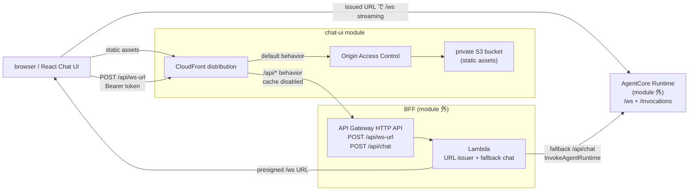

# AgentCore Chat UI

WEL Agents PoC 用の **React Chat UI の build artifact** を、private S3 bucket + CloudFront Origin Access Control（OAC）で配信する Terraform module。React UI は CloudFront の `/api/*` cache behavior 経由で [`../bff`](../bff) の `POST /api/ws-url` を呼び、BFF が発行した短命 AgentCore WebSocket URL で AgentCore Runtime `/ws` に streaming 接続する。`POST /api/chat` は fallback / smoke check 用。UI の source of truth はリポジトリルートの [`../../../packages/chat-ui`](../../../packages/chat-ui) で、配信する asset は `bun run build:ui` が生成する [`../../../dist/chat-ui`](../../../dist/chat-ui)。

この module は静的 UI の配信と `/api/*` の CloudFront routing だけを管理する。WebSocket URL issuer と fallback `InvokeAgentRuntime` を担う API Gateway + Lambda BFF は [`../bff`](../bff) が管理する。

> [WARNING] **S3・CloudFront・API Gateway / Lambda などの BFF は利用量に応じて課金される可能性がある。** 使用しない場合は [`cleanup.md`](./cleanup.md) に従って削除する。

## 構成図（概念）



## 前提

- `mise run bs` または `mise install` 済み（`terraform` / `aws-cli` は mise が `mise.toml` で固定）。
- `bun run build:ui` で `packages/chat-ui/` から `dist/chat-ui/` を生成済み。
- AWS provider が使える認証情報と region（`AWS_PROFILE` / `AWS_REGION` など）。
- [`../bff`](../bff) を apply 済みで、`chat_ui_origin` output を取得できる。
- `api_origin_domain_name` には scheme / path を含めない domain 名を指定する。
- JWT authorizer 付き BFF に接続する deploy build では、`bun run build:ui` の実行時に `VITE_AUTH_ISSUER` / `VITE_AUTH_CLIENT_ID` / `VITE_AUTH_REDIRECT_URI` / `VITE_AUTH_SCOPE` を設定する。これらは browser bundle に入る public config なので secret を入れない。
- [INFO] `mise run aws:apply`（`tools/tf/apply-stack.sh` の chat-ui ケース）を使う場合、この VITE_AUTH_* の設定と build は自動化されている。`terraform -chdir=terraform/aws/auth output chat_ui_auth_env` と chat-ui の `site_url` から VITE_AUTH_* を build 時に export 注入する（shell export が `packages/chat-ui/.env` を上書きする）。下記の手動 export 手順は orchestration を使わず手で build / apply する場合のもの。

## ローカル実行

デプロイ前に UI を確認する場合は、リポジトリルートから dev server を起動する。

```bash
mise run dev:ui
```

既定 URL は `http://127.0.0.1:4173/`。`BFF_URL`（`packages/chat-ui/.env`）を設定すると Vite proxy が `/api/ws-url` と fallback `/api/chat` を指定 BFF origin へ転送する。通常の React UI が呼ぶのは `/api/ws-url`。`AGENTCORE_RUNTIME_URL` や `DEFAULT_ACTOR_ID` は local BFF process 側の設定（`packages/bff/.env`）で、Chat UI の dev server は BFF への相対 `/api/*` request だけを proxy する。

local dev で `VITE_AUTH_*`（`packages/chat-ui/.env`）を未設定にすると、UI は `dev-local` access token を使う local dev auth mode になる。`.env` には常に VITE_AUTH_* を置かない運用にしておけば、ローカル=認証なし / 本番=`aws:apply` が自動注入、で切り替えの手間が無くなる。Cognito 認証をローカルで検証したいときだけ一時的に `VITE_AUTH_*` を設定して login する。

build 済み asset を確認する場合は、先に `bun run build:ui` を実行してから `mise run start:ui` を使う。

## 手順

すべてリポジトリルートから実行する（`-chdir` で root module を指す）。

### 1. tfvars を作成

```bash
cp terraform/aws/chat-ui/terraform.tfvars.template \
   terraform/aws/chat-ui/terraform.tfvars
```

[`../bff`](../bff) の output を `terraform.tfvars` に転記する。

```bash
mise exec -- terraform -chdir=terraform/aws/bff output chat_ui_origin
```

`terraform.tfvars` の設定例:

```hcl
api_origin_domain_name = "abc123.execute-api.ap-northeast-1.amazonaws.com"
api_origin_path        = ""
```

`terraform.tfvars` は環境固有値を含むためコミットしない。

### 2. plan / apply

JWT authorizer 付き BFF に接続する UI を deploy する場合は、build 前に public auth config を設定する。`VITE_AUTH_REDIRECT_URI` は OIDC provider に登録済みの Chat UI URL（CloudFront URL または custom domain）に合わせる。初回で CloudFront URL が未確定の場合、この module の初回 apply は `site_url` 取得目的になる。取得した `site_url` を `terraform/aws/auth` の `callback_urls` / `logout_urls` に追加して Auth を再 apply し、その後 `VITE_AUTH_REDIRECT_URI` を `site_url` に合わせて再 build / 再 apply する。

```bash
# JWT auth を使う deploy build では事前に設定する。secret は入れない。
# export VITE_AUTH_ISSUER="https://<oidc-authorize-token-base>"
# export VITE_AUTH_CLIENT_ID="<public-client-id>"
# export VITE_AUTH_REDIRECT_URI="https://<chat-ui-domain>/"
# export VITE_AUTH_SCOPE="openid email profile"

bun run build:ui
mise exec -- terraform -chdir=terraform/aws/chat-ui init
mise exec -- terraform -chdir=terraform/aws/chat-ui fmt -check
mise exec -- terraform -chdir=terraform/aws/chat-ui validate
mise exec -- terraform -chdir=terraform/aws/chat-ui plan
mise exec -- terraform -chdir=terraform/aws/chat-ui apply
```

### 3. URL を確認

```bash
mise exec -- terraform -chdir=terraform/aws/chat-ui output -raw site_url
```

出力された URL をブラウザで開く。CloudFront は `/api/ws-url` と fallback `/api/chat` の browser request を、キャッシュ無効で BFF origin にルーティングする。AgentCore Runtime `/ws` への WebSocket 接続は、BFF が発行した presigned URL を使って browser から Runtime へ直接張る。

## このモジュールが作るリソース

- `aws_s3_bucket.site`（静的 UI asset）
- `aws_s3_bucket_public_access_block.site`
- `aws_s3_bucket_ownership_controls.site`
- `aws_s3_bucket_server_side_encryption_configuration.site`
- `aws_s3_object.site`（`dist/chat-ui/` 配下の HTML / CSS / JS / favicon）
- `aws_s3_bucket_policy.site`（CloudFront distribution からの read のみ許可）
- `aws_cloudfront_origin_access_control.site`
- `aws_cloudfront_distribution.site`

API Gateway / Lambda / AgentCore Runtime などの BFF 側・Runtime 側リソースはこの module の管理外で、[`../bff`](../bff) と [`../agentcore`](../agentcore) が管理する。

## 更新

デプロイ済みの UI asset / CloudFront 設定 / BFF origin 設定を更新したときの手順は [`update.md`](./update.md) を参照する。

## cleanup

学習後は [`cleanup.md`](./cleanup.md) の手順で削除する。
